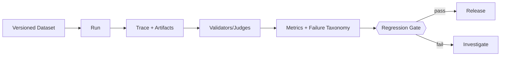

# Evaluation 闭环、Trace 与发布门

一次评测结束后，真正有用的不是只留一个总分，而是知道哪些任务退步、为什么退步，以及是否应该发布。下面把数据集、执行记录、检查器和发布条件连起来，让每次改动都有可比较的结果。

> **版本与资料依据**
> - `last_verified`: `2026-08-24`
> - `version_scope`: `stable evaluation architecture`
> - `source_type`: `engineering synthesis`
> - `stability`: `stable-concept`

## 最小数据模型

- Dataset：带版本的 case 集合；
- Task：goal、initial state、constraints、allowed actions；
- Environment：可重置的 repo/browser/API/sandbox；
- Trace：model/tool/control 事件与 artifact；
- Validator：确定性检查优先，judge 补充开放质量；
- Metrics：success、reliability、cost、latency、security；
- Run：代码、prompt、model、tool schema、dataset、environment 的完整版本组合。

## A/B 与回归

比较两版系统时，让同一个用例从相同初始状态出发，使用相同预算。模型存在随机性时需要重复运行，并报告结果波动；最好逐个配对比较，而不只看总平均。

发布条件可以包括：关键任务没有退步，所测权限用例没有违规，延迟和成本在约定范围内，已知问题没有复发。这里的“没有违规”指测试覆盖范围内的结果，不是对所有未来输入的保证。

## Trace 不是越多越好

Trace 事件需有 `trace_id/span_id/event_type/timestamp/attempt/tool_call_id/state_before/state_after/evidence_ref`。敏感 prompt、secret 和用户数据按字段脱敏与 retention policy 管理。可观测性用于定位，不应成为新的数据泄漏面。
