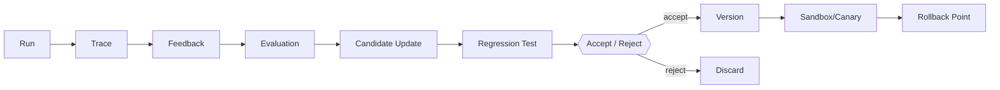

# Agent Evolution：受控改进闭环

所谓 Agent 演进，可以先理解为根据运行结果提出改动，再通过测试决定是否采用。它不等于让程序在生产环境里随意修改自己。下面分别讨论候选更新、评测和回滚，把“改进”变成可以检查的过程。

> **版本与资料依据**
> - `last_verified`: `2026-08-24`
> - `version_scope`: `2026 agent-improvement architecture`
> - `source_type`: `primary-paper + official-repository + engineering synthesis`
> - `stability`: `version-sensitive`

Agent Evolution 指系统根据运行证据生成并筛选可版本化更新。它不等同于保存一次对话，也不意味着系统在生产中直接改写自己。

## 先看一个区别：记住偏好，还是改变做事方法

用户说“以后示例用 Python”，系统保存这项偏好，下次生成代码时读取它，这是记忆。假如系统发现多次测试失败都因为漏装依赖，提出在执行前增加环境检查，这是改变工作方法。两者都可能修改文件，但修改的对象和验收办法不同。

持续进化可以先做得很朴素：保存一条失败轨迹，人工判断原因，提出一个小改动，在原失败任务和一组未参与修改的任务上测试，再决定是否发布。先不要让系统看到一次失败就直接改生产提示词；这很容易修好一个例子，却破坏其他任务。

[原书第 9 章](https://bojieli.github.io/ai-agent-book/book/chapter9/)讨论从运行轨迹获得学习信号。本章把这个思路落到可检查的修改过程：保留旧版本、写清假设、记录评测，再决定接受或撤回。仅更新提示词、Skill 或工具配置没有训练模型参数，不要把它叫作模型已经完成了后训练。

## 四类更新

1. **Context / Memory Evolution**：selection policy、summary、memory write/retrieval/forgetting；
2. **Skill Evolution**：新增/修改能力说明、脚本、examples、tests；
3. **Workflow / Program Evolution**：planner、routing、tool policy、代码或 DAG；
4. **Model / Parameter Evolution**：SFT、preference optimization、RL 或 tool-use training。

每类都要求 evaluator 与待更新组件隔离、候选有版本、在 sandbox 运行、明确 permission owner、回归集与 rollback。生产 trace 只能作为候选数据源，不能直接成为可信指令。

## Self-Evolution 与 Memory 的区别

Memory 更新的是任务/用户状态；Evolution 更新的是系统行为组件。读取“用户偏好 Java”是 memory；根据失败样本修改 tool schema 或 skill 是 evolution。二者都需 provenance，但审批、测试和发布流程不同。
