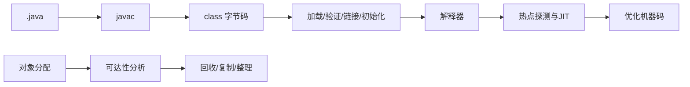

# JVM 内存、类加载、字节码与垃圾收集

写下 `new` 之后，对象在哪里分配？一个方法反复调用，执行方式会一直相同吗？JVM 负责处理这些运行细节。下面把编译、类加载、方法执行和垃圾收集连起来看，再介绍怎样观察一个正在运行的进程。

JVM 主题把 Java 源码、class 文件、运行时数据区、对象分配、方法执行、JIT 与垃圾收集连接起来。学习目标是能解释和诊断，而不是背诵某个收集器的旧默认参数。

## 1. 学习目标

- 理解 class 文件与类加载生命周期
- 区分堆、栈、方法区语义和本地内存
- 理解可达性、分代假设、停顿与并发收集
- 会用 jcmd/JFR 建立诊断证据

## 2. 核心概念

### 1. class 文件与执行

`javac` 生成包含常量池、字段、方法和字节码指令的 class 文件。JVM 加载、验证、准备、解析和初始化类；解释器先执行热点代码，JIT 可基于运行时信息编译和优化。

**这里容易混淆的是：** 源代码的一行不一定对应一条字节码；JIT 还可能内联、逃逸分析并去优化。

### 2. 类加载器与初始化

类身份由二进制类名和定义它的类加载器共同确定。父加载委派减少核心类型重复。初始化在首次主动使用时执行 `<clinit>`，失败会影响后续使用。

**这里容易混淆的是：** “同名 class”不保证是同一类型；插件、应用服务器和热部署常涉及多个加载器。

### 3. 运行时内存

堆通常保存对象；每线程 Java 栈包含栈帧、局部变量和操作数栈；方法区是规范概念，HotSpot 用 Metaspace 等实现类元数据；直接缓冲、线程栈、代码缓存也消耗本地内存。

**这里容易混淆的是：** 进程内存大于 Java 堆很正常；只看 `-Xmx` 不能解释容器 OOM。

### 4. GC 与诊断

GC 从根集合做可达性分析并回收不可达对象。不同收集器在吞吐、停顿、并发开销和内存余量间权衡。诊断应从 GC 日志、JFR、类直方图、线程和堆转储建立时间线。

**这里容易混淆的是：** `System.gc()` 是建议且通常不是泄漏修复；高 GC 可能是分配速率、存活集或内存上限问题。

## 3. 运行链路



## 4. 最小示例

```bash
javac --release 25 Demo.java
javap -c -v Demo
jcmd <pid> VM.flags
jcmd <pid> GC.heap_info
jcmd <pid> GC.class_histogram
jcmd <pid> JFR.start name=baseline duration=60s filename=baseline.jfr
```

## 5. 练习与验证

1. 用 javap 比较字符串拼接与循环代码
2. 创建受控内存增长并观察 JFR/类直方图
3. 改变堆上限但保持负载不变，比较吞吐和停顿

## 6. 常见误区

- 把方法区等同于某个永久实现名词
- 只凭一次堆转储断言泄漏
- 未经基准复制旧版本 GC 参数

## 7. 掌握检查

为什么进程内存会大于 Java 堆？请结合线程栈、类元数据和代码缓存解释，并说出准备怎样观察。

先不看答案，用本章示例解释一遍；再改变一个输入或配置，检查实际结果是否符合你的判断。

## 参考资料

- [JVM Specification 25](https://docs.oracle.com/javase/specs/jvms/se25/html/)
- [HotSpot GC Tuning Guide](https://docs.oracle.com/en/java/javase/25/gctuning/)
- [JDK Mission Control](https://docs.oracle.com/en/java/javase/25/jmc/)
