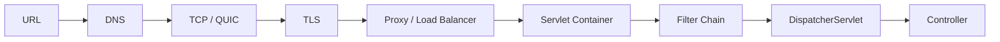

# Internet 心智模型：从 URL 到 Spring Controller

在浏览器输入地址到 Controller 收到请求之间，还经过了 DNS、连接建立、代理和服务器处理。沿着一次请求逐站检查，能帮助你判断超时、证书错误或 404 到底发生在哪一层，而不是一律归为后端代码错误。

> **版本与资料依据**
> - `last_verified`: `2026-08-24`
> - `version_scope`: `HTTP semantics and backend fundamentals`
> - `source_type`: `RFC + official platform docs`
> - `stability`: `stable-concept`

## 1. 一次请求

先看 URL：协议、主机、端口和路径分别告诉浏览器怎样连接、连接哪里、请求什么。DNS 把主机名解析成地址；连接可能使用 TCP 与 TLS，也可能使用 HTTP/3 所用的 QUIC。

请求到达服务端后，代理或负载均衡器选择实例。Servlet 容器处理 HTTP，请求经过过滤器，再由 Spring MVC 找到控制器、转换并校验参数。业务方法返回后，结果还要转换成 HTTP 响应。图展示的是便于学习的逻辑顺序，不表示每次请求都会重新建立连接或重新查询 DNS。

## 2. HTTP semantics

HTTP 方法、状态码、响应头、资源表示、缓存和条件请求，共同约定一次调用的含义。幂等性尤其影响失败后是否可以重试。`GET` 应安全；`PUT` 语义上幂等；`POST` 是否可重试取决于应用提供的 idempotency key。keep-alive 复用连接，不等同于 WebSocket。

## 3. Proxy、cookie 与 CORS

- forward proxy 代表客户端；reverse proxy 代表服务端；load balancer 是路由/分配职责，不自动解决应用状态。
- Cookie 由浏览器按 domain/path/SameSite/Secure/HttpOnly 规则发送；server-side session 与 cookie 不是同一对象。
- CORS 是浏览器对跨源脚本请求的策略；它不是服务端认证，也不阻止非浏览器客户端。

## 4. 诊断顺序

DNS→连接→TLS→HTTP status/headers→proxy route→container/filter→controller→DB/downstream。使用 `curl -v`、DNS 工具、证书检查、access log、trace/span 和应用日志关联 request id，避免把所有超时归因于 Controller。
