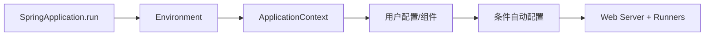

# Spring Boot 自动配置、Starter、配置文件与启动过程

加入 starter 后，很多对象不再需要手动声明，这不是 Boot 猜中了你的业务，而是自动配置条件生效了。下面从启动入口跟到条件判断，学会在默认行为不合适时查原因、做覆盖。

> **版本与资料依据**
> - `last_verified`: `2026-08-24`
> - `version_scope`: `Spring Boot 4.x`
> - `source_type`: `official-docs`
> - `stability`: `fast-moving`


Spring Boot 不是 Spring 的替代品，而是在 Spring Framework 上提供自动配置、starter、可执行打包和生产默认值。

## Spring Boot 到底替你做了什么

Spring 管理对象和应用基础设施，Spring Boot 则把常见应用的启动和配置整理成一套约定。比如你引入 Web starter 后，Boot 根据类路径、配置和已有 Bean 判断要准备哪些 Web 组件。这个过程叫自动配置，不是完全不需要配置。

可以把 starter 看成一组相关依赖的入口，把自动配置看成“满足这些条件就装配这些对象”。你自己声明某些 Bean 后，相应自动配置可能退让，因此遇到差异先看条件报告，不要认定是注解顺序随机决定的。

练习时先做一个返回固定文本的接口，再依次加入配置、参数校验和错误处理。每加一个组件，都确认它由谁创建、读取哪个配置、如何测试。这样的学习顺序比第一天就复制几十项生产配置更容易排错。

## 1. 本文覆盖范围

- @SpringBootApplication 与启动阶段
- starter、依赖管理和条件化自动配置
- 外部化配置、优先级、profile 与强类型绑定
- Boot 4.x/3.x 与 Java 版本选择、AOT/native

## 2. 核心知识详解

### 1. 启动与组合注解

@SpringBootApplication 组合配置、组件扫描和自动配置。SpringApplication 推断应用类型、准备 Environment、创建 ApplicationContext、加载 Bean 并触发 runner。

- 主类放在合理根包，防止漏扫或过度扫描。
- 启动失败查看 Conditions Evaluation Report 和首个根因。
- runner 只做短小初始化，长期任务交给生命周期组件。

**这里容易混淆的是：** 组件扫描与自动配置是两条机制；排除自动配置不等于排除组件扫描 Bean。

### 2. Starter 与自动配置条件

starter 聚合依赖，auto-configuration 根据 classpath、Bean、属性和 Web 类型条件创建默认 Bean，并允许用户自定义 Bean back off。

- 通过 `--debug`/Actuator conditions 观察匹配原因。
- 自建 starter 拆分 autoconfigure 与 starter 模块，并提供 metadata。
- 不要复制 Boot 管理版本后再随意覆盖。

**这里容易混淆的是：** 自动配置是条件化普通配置，不是运行时“魔法扫描所有可能”。

### 3. 外部化配置与优先级

Boot 从配置文件、环境变量、系统属性、命令行等属性源合并值，优先级影响最终结果。ConfigurationProperties 提供层次化类型绑定和校验。

- 配置命名稳定、默认值安全、启动时 fail-fast。
- 环境差异通过外部注入，制品保持相同。
- 敏感值脱离普通配置库并限制 Actuator 暴露。

**这里容易混淆的是：** profile 只控制激活配置，不提供 secret 保护和动态配置一致性。

### 4. 版本与 AOT

截至 2026-07，Spring Boot 4.1 为最新稳定线，同时 4.0、3.5 等维护线仍存在。项目选择必须结合 JDK、Spring Cloud 和第三方 starter 兼容矩阵。

- 新项目可评估 JDK 25 LTS + Boot 4.x，迁移项目按官方 migration guide 分阶段。
- AOT/native image 改变反射、代理和资源发现，需要 hints 与专门测试。
- 不要仅为启动速度牺牲调试、兼容和构建成本。

**这里容易混淆的是：** 版本号最新不等于生态组件全部支持；依赖必须按 release train/BOM 组合验证。

## 3. 工程链路



## 4. 教学示例（结合本章运行前提）

先看两个条件：依赖类存在，并且用户没有定义同类 Bean 时，才提供默认客户端。`ClientProperties` 和自动配置发现配置需要在项目中补齐。练习时可以主动声明自己的客户端，再观察默认 Bean 是否退出。

```java
@AutoConfiguration
@ConditionalOnClass(HttpClient.class)
@EnableConfigurationProperties(ClientProperties.class)
class ClientAutoConfiguration {
  @Bean
  @ConditionalOnMissingBean
  HttpClient client(ClientProperties p) {
    return HttpClient.newBuilder().connectTimeout(p.timeout()).build();
  }
}
```

## 5. 实践与验证

1. 用 conditions report 解释 DataSource 自动配置为何匹配/未匹配。
2. 写一个带配置 metadata 和 back-off 规则的小型 starter。
3. 在 Boot 3.5 与 4.1 测试同一最小应用的兼容差异。

## 6. 掌握检查

- [ ] 能拆解 @SpringBootApplication。
- [ ] 能解释 starter 与 auto-configuration。
- [ ] 能确定属性最终来源与优先级。
- [ ] 能按兼容矩阵选择 Boot/JDK。

## 参考资料

- [Spring Boot Reference](https://docs.spring.io/spring-boot/reference/)
- [Auto-configuration](https://docs.spring.io/spring-boot/reference/using/auto-configuration.html)
- [Externalized Configuration](https://docs.spring.io/spring-boot/reference/features/external-config.html)
- [Spring Boot 4.1](https://spring.io/projects/spring-boot/)
