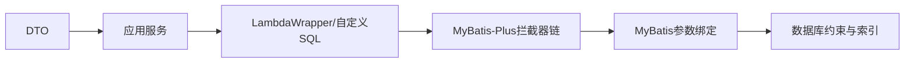

# MyBatis-Plus 工程实践

MyBatis-Plus 可以减少常见增删改查的样板代码，但生成 SQL 仍然要在真实表和索引上执行。先用它完成简单查询，再查看实际语句；遇到复杂条件时，回到显式 SQL 并不代表使用失败。

MyBatis-Plus 在 MyBatis 上提供通用 Mapper、条件构造器、分页和插件，以减少重复 CRUD。它保留 MyBatis 的 SQL 模型，复杂查询、索引与事务仍需开发者负责。

## 1. 学习目标

- 掌握 BaseMapper 与 LambdaWrapper
- 理解分页、乐观锁、逻辑删除与多租户插件
- 避免字段泄漏、SQL 注入和无条件更新

## 2. 核心概念

### 1. 实体与 Mapper

`@TableName`、`@TableId`、`@TableField` 描述映射，`BaseMapper` 提供常用单表方法。DTO、领域对象和数据库实体职责不同，外部请求不应直接控制实体全部字段。

**这里容易混淆的是：** 通用 CRUD 只减少样板，不应让 Controller 直接暴露 Mapper。

### 2. 条件构造器

LambdaWrapper 用方法引用表达列，降低字符串列名重构风险。动态条件应显式控制，排序字段使用白名单，禁止把客户端片段传给 `last`/`apply`。

**这里容易混淆的是：** 参数值通常会绑定，但原样拼接 SQL 片段仍可能形成注入。

### 3. 插件

分页插件改写 count 和 page SQL；乐观锁插件依赖 version 条件更新；逻辑删除用标记替代物理删除；多租户插件注入 tenant 条件。插件顺序和不适用语句需测试。

**这里容易混淆的是：** 逻辑删除不能自动满足隐私擦除；多租户插件也不能替代数据库权限与测试。

### 4. 批量与性能

批量写需要控制批大小、事务长度、驱动选项和失败定位。分页 count 对复杂查询可能昂贵；大数据滚动使用稳定唯一排序的游标。

**这里容易混淆的是：** `saveBatch` 不保证所有数据库/驱动场景都生成单条批语句，应以日志和指标验证。

## 3. 运行链路



## 4. 最小示例

```java
Page<UserEntity> page = new Page<>(1, 20, true);
LambdaQueryWrapper<UserEntity> query = Wrappers.lambdaQuery();
query.eq(UserEntity::getTenantId, tenantId)
    .eq(status != null, UserEntity::getStatus, status)
    .likeRight(keyword != null, UserEntity::getName, keyword)
    .orderByDesc(UserEntity::getId);

IPage<UserEntity> result = userMapper.selectPage(page, query);
```

## 5. 练习与验证

1. 验证乐观锁冲突时受影响行数
2. 对复杂分页检查 count SQL
3. 测试租户条件覆盖查询、更新和删除

## 6. 常见误区

- 从请求接收任意排序字段并拼接
- 忽略批量事务过大与失败定位
- 把逻辑删除当作自动数据归档

## 7. 掌握检查

一个 Wrapper 查询变慢时，你会先看什么 SQL 和执行计划？请说明框架替你做了什么、没做什么。

先不看答案，用本章示例解释一遍；再改变一个输入或配置，检查实际结果是否符合你的判断。

## 参考资料

- [MyBatis-Plus Introduction](https://baomidou.com/en/introduce/)
- [Persistence Layer Interface](https://baomidou.com/en/guides/data-interface/)
- [MyBatis-Plus Plugins](https://baomidou.com/en/plugins/)
