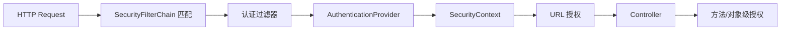

# Spring Security：过滤链、认证、授权与方法安全

一次请求进入 Spring MVC 之前，通常已经经过安全过滤链。用户身份怎样建立、权限在哪里检查，都与这条链有关。下面沿着请求顺序介绍，再解释为什么方法级授权仍然有用。

Spring Security 在 Servlet 应用中通过 SecurityFilterChain 建立安全上下文，并在请求与方法边界执行认证和授权。

## 1. 本文覆盖范围

- 过滤链与 SecurityContext
- AuthenticationProvider
- 请求与方法授权
- 密码、会话与审计

## 2. 核心知识详解

### 1. 过滤链和上下文

请求先匹配一条 `SecurityFilterChain`，过滤器按顺序处理上下文加载、认证机制、异常转换和授权。上下文默认与当前请求线程关联。

- 多条 chain 的 matcher 从专用到通用排列。
- 异步任务显式传播最小身份信息。
- 拒绝响应区分未认证 401 与权限不足 403。

**这里容易混淆的是：** 自己插入 filter 时顺序错误会绕过或重复处理；优先使用框架 DSL 和标准扩展点。

### 2. 认证提供者

AuthenticationManager 把凭据交给匹配的 AuthenticationProvider；成功后返回已认证主体与 authorities。密码以自适应单向哈希保存。

- BCrypt/Argon2 等参数随硬件和风险升级。
- 登录失败信息避免账号枚举，同时保留内部审计原因。
- MFA、设备和风险策略属于更高层认证流程。

**这里容易混淆的是：** 加密密码后可解密与密码哈希是不同方案；服务端保存的是不可逆验证值。

### 3. 授权模型

请求授权保护 URL，方法授权保护服务操作；RBAC 易管理，ABAC/资源所有权表达上下文。默认拒绝和最小权限减少漏配。

- 权限使用业务动作如 `order:refund`，不要只依赖角色名。
- 对象级授权在加载/修改资源时检查租户与所有权。
- 管理员操作和权限变化记录不可抵赖审计。

**这里容易混淆的是：** 隐藏按钮只是用户体验，不是授权；服务端每个敏感操作仍检查权限。

### 4. 会话与注销

Cookie 会话由服务端状态和浏览器 cookie 标识，需 Secure、HttpOnly、SameSite、固定攻击防护和过期策略。注销使会话/refresh token 失效。

- 登录后轮换 session id。
- 并发会话和绝对/空闲超时按风险设置。
- 集群会话可共享存储或使用粘性，但都规划故障。

**这里容易混淆的是：** 删除浏览器 cookie 不一定撤销服务端会话或其他设备令牌。

## 3. 工程链路



## 4. 教学片段：真的建立一条授权过滤链

下面是 Spring Boot 4 / Spring Security 7 的 Servlet 配置类，放在应用扫描路径下。需要 Web、安全依赖，以及你自己的用户来源或认证提供者；它不是独立 `main` 程序。省略 import，由 IDE 导入对应 Spring 类型。

```java
@Configuration
@EnableMethodSecurity
public class SecurityConfig {
  @Bean
  SecurityFilterChain web(HttpSecurity http) throws Exception {
    return http
      .authorizeHttpRequests(auth -> auth
        .requestMatchers("/public/**").permitAll()
        .requestMatchers("/admin/**").hasAuthority("admin:read")
        .anyRequest().authenticated())
      .formLogin(Customizer.withDefaults())
      .build();
  }
}
```

请求 `/public/help` 允许匿名访问；请求 `/admin/report` 要求已认证主体带有 `admin:read` 权限；其余路径要求登录。匹配规则有顺序，专用规则写在兜底规则之前。`hasAuthority` 按给出的权限字符串匹配，不会自动补 `ROLE_`。

本例采用浏览器表单登录：未认证请求可能被重定向到登录页，而不是一概返回 401。JSON API 若约定返回 401，需要另外配置认证入口和响应格式。权限不足与未认证也不能混成同一种错误。CSRF 防护保持开启；会话表单写请求需带有效 CSRF token，不能为了“请求能过”直接删掉保护。

方法授权可在由 Spring 管理的服务方法上写 `@PreAuthorize("hasAuthority('order:refund')")`。它仍受代理调用边界影响，自调用不会自动穿过代理；订单归属和租户条件也需要在服务端另行检查。用三种身份实际请求验证，再添加“用户 A 请求用户 B 订单”的测试，才能证明规则覆盖了业务边界。

配置依据：[Java Configuration](https://docs.spring.io/spring-security/reference/servlet/configuration/java.html)。

## 5. 实践与验证

1. 为普通用户、运营和管理员设计动作权限矩阵。
2. 写 401、403、跨租户访问和方法授权测试。
3. 演练密码参数升级与会话注销。

## 6. 掌握检查

- [ ] 能画出过滤链。
- [ ] 能区分认证和授权。
- [ ] 能实现对象级授权。
- [ ] 能解释安全会话配置。

## 参考资料

- [Spring Security Reference](https://docs.spring.io/spring-security/reference/index.html)
- [Spring Security Architecture](https://docs.spring.io/spring-security/reference/servlet/architecture.html)
- [Password Storage](https://docs.spring.io/spring-security/reference/features/authentication/password-storage.html)
