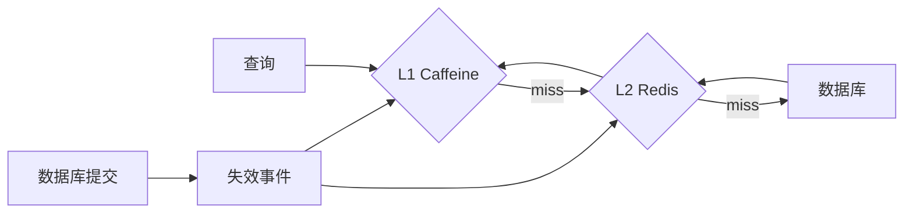

# Caffeine 本地缓存与多级缓存

如果某份数据很小又经常读取，放在当前 JVM 的内存里可以省去一次网络请求。Caffeine 提供了这类缓存的管理能力。不过部署多个实例后，每个实例都有自己的副本，更新和失效就要另外考虑。

Caffeine 是高性能 JVM 进程内缓存。它省去网络往返，适合热点只读/可重算数据；但每个实例拥有独立副本，容量、过期、加载并发和跨实例失效必须设计。

## 1. 学习目标

- 理解 size/time/reference eviction
- 掌握同步与异步加载及统计
- 设计本地+Redis+数据库多级缓存

## 2. 核心概念

### 1. 淘汰与过期

`maximumSize/maximumWeight` 控制容量；`expireAfterWrite` 从写入计时，`expireAfterAccess` 从最近访问计时，`refreshAfterWrite` 允许读取旧值并触发刷新。淘汰维护通常在读写时摊还执行。

**这里容易混淆的是：** refresh 不是强制失效；加载失败时可能继续返回旧值，需按业务定义。

### 2. 加载与并发

LoadingCache 将同一键加载合并以降低击穿；AsyncLoadingCache 返回 CompletableFuture。加载函数不应递归访问同一键，且需设置下游超时和失败策略。

**这里容易混淆的是：** 缓存不会修复慢且无界的加载器；异步加载仍占用线程和连接。

### 3. 多级缓存

L1 Caffeine 最快但实例私有，L2 Redis 跨实例共享，数据库是事实来源。读路径逐级回源，写路径通常先提交数据库，再通过事件失效 L2 与各实例 L1。

**这里容易混淆的是：** 多级缓存扩大不一致组合，应为版本、失效丢失和重放定义行为。

### 4. 观测

记录 hit/miss/load success/load failure/eviction、加载耗时和估算大小，按业务命中收益而非单一命中率判断。

**这里容易混淆的是：** 高命中率可能来自低价值小对象，同时真正昂贵键仍未缓存。

## 3. 运行链路



## 4. 最小示例

```java
LoadingCache<Long, Product> products = Caffeine.newBuilder()
    .maximumSize(10_000)
    .expireAfterWrite(Duration.ofMinutes(5))
    .refreshAfterWrite(Duration.ofMinutes(1))
    .recordStats()
    .build(productRepository::requireById);

Product product = products.get(productId);
```

## 5. 练习与验证

1. 压测同一热点键并验证加载合并
2. 模拟失效事件丢失并用版本/TTL 收敛
3. 比较 L1 命中前后尾延迟与堆占用

## 6. 常见误区

- 缓存无限增长
- 缓存 null 却没有短 TTL
- 在每个实例手工失效而无可靠广播

## 7. 掌握检查

部署两个实例后，为什么一个实例的缓存失效不会自动清掉另一个？怎样测试这一点？

先不看答案，用本章示例解释一遍；再改变一个输入或配置，检查实际结果是否符合你的判断。

## 参考资料

- [Caffeine Wiki](https://github.com/ben-manes/caffeine/wiki)
- [Caffeine Javadoc](https://www.javadoc.io/doc/com.github.ben-manes.caffeine/caffeine/latest/)
