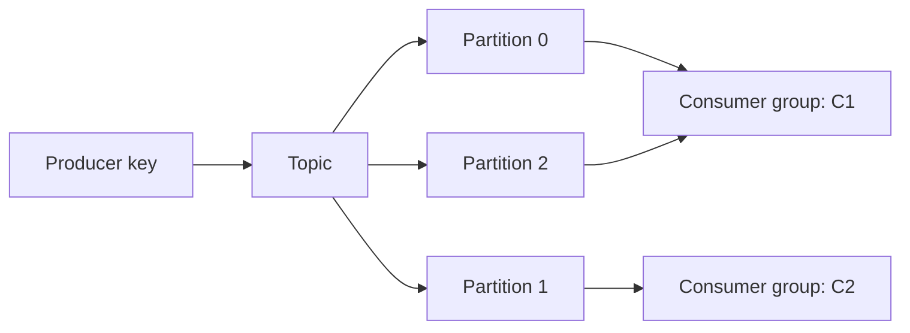

# Apache Kafka：日志、分区、副本、消费组与事务

Kafka 中，消费者处理过的消息不一定立即从存储中消失；消费位置由 offset 表示。理解日志和位置这两个概念，再看分区、消费组和重放，就能解释它与传统工作队列的许多差异。

Kafka 把 topic 表示为分区追加日志，消费者以 offset 追踪位置，适合事件流、日志集成和可重放处理。

## 1. 本文覆盖范围

- Topic/partition/record
- 副本、leader 与 producer ack
- 消费组与 offset
- 幂等生产、事务与再均衡

## 2. 核心知识详解

### 1. 日志与分区

record 按 key 分配到 partition，分区内有序并以 offset 定位；保留按时间/大小或 compact 策略执行。

- 分区数决定最大并行度和元数据开销。
- key 选择兼顾实体顺序与热点。
- compact 保留每个 key 的最近值语义，不等同于立即只留一条。

**这里容易混淆的是：** offset 不是跨分区的全局时间顺序。

### 2. 生产可靠性

acks、min.insync.replicas、副本因子和 unclean leader election 共同影响耐久性与可用性。幂等 producer 避免单会话重试重复。

- 批量、linger、压缩在延迟与吞吐间权衡。
- 处理超大消息会影响网络、内存和复制。
- 监控 ISR、under-replicated partition 和请求错误。

**这里容易混淆的是：** acks=all 的强度依赖 ISR 配置和 broker 持久性，仍需说明故障模型。

### 3. 消费组与再均衡

同组内每个分区同时由一个成员消费；成员变化触发分区再分配。offset 提交位置必须与业务处理语义一致。

- 批量拉取后逐条失败要记录精确进度。
- 长处理调整 poll/heartbeat 参数或把工作移交并控制并发。
- 静态成员与 cooperative rebalance 可减少停顿，但不消除故障。

**这里容易混淆的是：** 先提交 offset 再处理会造成丢失窗口；处理后提交会产生可控重投。

### 4. 事务与流处理

Kafka 事务可原子写多个分区并提交消费 offset，read_committed 消费者过滤未提交记录；Kafka Streams 用 state store 和 changelog 支撑状态处理。

- 事务 id 在实例间唯一且支持 fencing。
- 外部数据库仍用 outbox/idempotency 连接。
- 状态存储配置恢复时间和磁盘预算。

**这里容易混淆的是：** Kafka exactly-once 语义有明确系统边界，不覆盖任意外部副作用。

## 3. 工程链路



## 4. 教学片段：处理与提交位置的先后

假设已有正确配置的 `KafkaConsumer<String, String> consumer`，关闭 `enable.auto.commit`，并在同一个线程执行下面的循环。`processIdempotently` 是你实现的业务函数，不是 Kafka SDK 方法。需要导入 `java.time.Duration`；真实项目还需订阅主题、关闭资源和处理再均衡。

```java
while (running) {
  var records = consumer.poll(Duration.ofMillis(500));
  for (var record : records) {
    processIdempotently(record.key(), record.value());
  }
  consumer.commitSync();
}
```

设一次取到 offset 10、11、12。全部业务处理成功后再提交，表示下次从这些已处理记录之后继续；提交的是下一条读取位置，不是“删除这些消息”。如果处理 11 时抛异常，循环不能跳过错误却继续提交整个批次的位置，否则可能漏掉 11。

这个简化循环让异常退出处理路径，交给外围记录故障并关闭消费者。10 已成功而提交尚未发生，恢复后可能再次处理 10，因此业务端仍需去重。若处理成功、提交时断网，也不能确定提交是否已到达 broker；查询和恢复必须容忍重复。不要在捕获异常后无条件执行 `commitSync()`。

为了在单线程模型下方便理解，这里没有异步派发记录。把处理交给线程池后，提交位置必须依据每个分区连续完成的进度计算，不能直接照搬这段代码。Kafka 事务可用于 Kafka 内的消费—处理—生产链路，普通数据库写入不会因此自动加入同一事务。

## 5. 实践与验证

1. 建立三分区 topic，验证同 key 顺序和跨分区无全序。
2. 模拟消费者再均衡和处理后未提交 offset。
3. 比较普通 producer、幂等 producer 与事务 producer 的边界。

## 6. 掌握检查

- [ ] 能设计分区 key。
- [ ] 能解释 ISR 与 ack。
- [ ] 能处理再均衡。
- [ ] 能准确限定 Kafka 事务。

## 参考资料

- [Apache Kafka Documentation](https://kafka.apache.org/documentation/)
- [Kafka Design](https://kafka.apache.org/documentation/#design)
