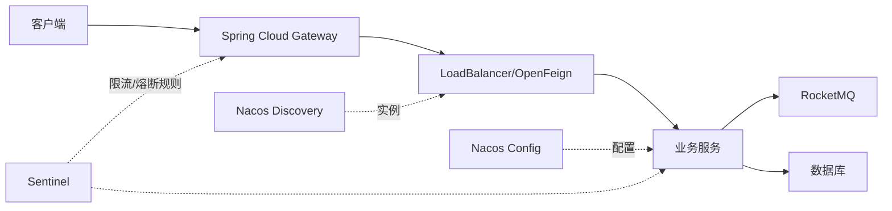

# Spring Cloud 与 Spring Cloud Alibaba 组件图

Spring Cloud 的组件图可以当索引，但不必把图上的组件全部装进项目。先确认你缺的是寻址、配置还是流量控制，再选择对应组件。最后再核对 Spring Boot 和发行版本是否配套。

> **版本与资料依据**
> - `last_verified`: `2026-08-24`
> - `version_scope`: `Spring Cloud 2025.1 / Spring Cloud Alibaba 2025.1.x`
> - `source_type`: `official-docs`
> - `stability`: `fast-moving`


Spring Cloud 提供分布式常见模式的一组抽象与实现；Spring Cloud Alibaba 集成 Nacos、Sentinel 等生态能力。选型先从需求和失败模型出发，再核对发行列车与 Spring Boot 兼容矩阵。

## 1. 学习目标

- 理解配置、发现、负载均衡、网关和声明式客户端
- 掌握 Spring Cloud Alibaba 常见组件职责
- 会核对版本兼容与最小依赖

## 2. 核心概念

### 1. 发行列车与兼容

Spring Cloud 以 release train 管理一组项目版本，必须与 Spring Boot 代际兼容。BOM 统一版本，避免逐个填写组件版本。

**这里容易混淆的是：** “最新组件版本”混搭不保证二进制和自动配置兼容。

### 2. 发现、配置与调用

DiscoveryClient 提供实例列表，LoadBalancer 选择实例，OpenFeign 生成 HTTP 客户端代理，Config/Nacos Config 管理外部配置。调用仍需 timeout、连接池、幂等和可观测性。

**这里容易混淆的是：** 服务发现解决地址变化，不解决 API 契约兼容和业务授权。

### 3. 网关

Spring Cloud Gateway 在入口做路由、TLS 终止、认证协作、限流和观测。业务资源级授权仍在服务内执行，避免网关成为所有领域规则的单点。

**这里容易混淆的是：** 网关过滤器不应执行长事务或直接写各服务数据库。

### 4. Alibaba 生态

Nacos 提供注册发现与配置；Sentinel 提供流量治理；RocketMQ 支持消息；Seata 提供分布式事务模式。每个组件都需要独立高可用、数据持久化和故障演练。

**这里容易混淆的是：** 加入组件会增加运行成本，不是系统可靠性的自动开关。

## 3. 运行链路



## 4. 最小示例

```yaml
spring:
  application:
    name: order-service
  config:
    import:
      - optional:nacos:order-service.yaml?group=DEFAULT_GROUP
  cloud:
    nacos:
      server-addr: ${NACOS_ADDR}
      discovery:
        namespace: ${NACOS_NAMESPACE}
```

## 5. 练习与验证

1. 按官方矩阵建立最小 BOM
2. 让注册中心短暂失联并观察缓存实例行为
3. 验证网关与服务端双层授权

## 6. 常见误区

- 只设置连接超时而无响应超时
- 配置刷新破坏不变量且无审计
- 将所有内部流量都强制绕公网网关

## 7. 掌握检查

项目需要动态配置，却不需要远程调用时，你会选哪些组件？请解释为什么不安装其余组件。

先不看答案，用本章示例解释一遍；再改变一个输入或配置，检查实际结果是否符合你的判断。

## 参考资料

- [Spring Cloud Supported Versions](https://github.com/spring-cloud/spring-cloud-release/wiki/Supported-Versions)
- [Spring Cloud Reference](https://docs.spring.io/spring-cloud-reference/)
- [Spring Cloud Alibaba](https://sca.aliyun.com/en/)
