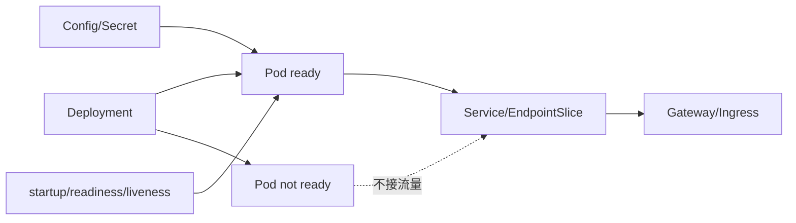

# Kubernetes：工作负载、网络、配置、Secret 与探针

Kubernetes 不会替应用理解业务，它主要不断协调实际状态与声明的期望状态。应用要主动告诉平台何时可接流量、何时需要重启，并正确处理停止。下面围绕一个服务的部署过程学习这些配合方式。

> **版本与资料依据**
> - `last_verified`: `2026-08-24`
> - `version_scope`: `Kubernetes version-sensitive concepts`
> - `source_type`: `official-docs`
> - `stability`: `fast-moving`


Kubernetes 以声明式控制器协调期望状态；应用需要配合不可变镜像、探针、资源、终止和配置语义。

## 1. 本文覆盖范围

- Pod/Deployment/StatefulSet/Job
- Service、Ingress/Gateway 与 DNS
- ConfigMap/Secret
- requests/limits、probe 与滚动更新

## 2. 核心知识详解

### 1. 工作负载控制器

Pod 是调度单元；Deployment 管理无状态 ReplicaSet；StatefulSet 提供稳定身份/存储顺序；Job/CronJob 管理完成型任务。

- 应用副本保持无状态或把状态放外部持久系统。
- PDB 和 topology spread 改善维护与故障域分布。
- 批任务有幂等、并发、重试和截止时间。

**这里容易混淆的是：** StatefulSet 提供稳定身份，不自动让数据库复制或故障转移正确。

### 2. 服务网络

Service 为动态 Pod 集合提供稳定虚拟地址，EndpointSlice 记录后端；Ingress 或 Gateway API 管理外部 L7 路由。

- readiness 失败的 Pod 从服务端点移除。
- NetworkPolicy 是流量准入规则。没有相关策略选中时，Pod 默认并非“全部拒绝”；入口、出口隔离分别计算。生产练习可以先**主动配置** default-deny，再按 DNS、数据库等实际依赖开放，前提是所用网络插件支持策略。参见 [Kubernetes 网络策略](https://kubernetes.io/docs/concepts/services-networking/network-policies/)。
- DNS 缓存、连接复用和 Pod 终止配合。

**这里容易混淆的是：** Service 可达不代表应用 ready，且 NetworkPolicy 是否生效取决于网络实现。

### 3. 配置与秘密

ConfigMap/Secret 可作为环境或文件挂载；更新传播方式和应用刷新行为不同。Secret 对象的 base64 只是编码。

- 开启静态加密、RBAC 和外部秘密管理。
- 配置带 schema 和版本，发布可回滚。
- Pod 不拥有读取整个 namespace secrets 的权限。

**这里容易混淆的是：** 把秘密放 Kubernetes Secret 仍需要 etcd 加密、访问审计和轮换。

### 4. 资源与探针

scheduler 使用 requests 放置 Pod，limits 由运行时执行；startup/liveness/readiness 分别处理启动、重启和接流量。

- CPU limit 可能节流，内存超限会 OOM kill。
- preStop、terminationGracePeriod 和服务摘流完成优雅终止。
- 滚动发布设置 maxUnavailable/maxSurge 和 readiness gate。

**这里容易混淆的是：** liveness 依赖数据库会在数据库故障时重启全部服务，扩大事故。

## 3. 工程链路



## 4. 最小可运行示例

就绪探针决定实例是否应接收流量，存活探针用于判断是否需要重启。片段要放进容器定义，并启用对应健康端点。测试时分别模拟启动较慢和服务失去响应，不要把普通外部依赖波动都当成必须重启的理由。

```yaml
readinessProbe:
  httpGet:
    path: /actuator/health/readiness
    port: 8080
  initialDelaySeconds: 10
livenessProbe:
  httpGet:
    path: /actuator/health/liveness
    port: 8080
  failureThreshold: 3
```

## 5. 实践与验证

1. 部署 3 副本应用，验证 readiness 摘流和滚动升级。
2. 设置 requests/limits 并观察 CPU throttling 与 OOM。
3. 写默认拒绝 NetworkPolicy 和最小依赖规则。

## 6. 掌握检查

- [ ] 能选工作负载控制器。
- [ ] 能解释 Service 到 Pod。
- [ ] 能安全使用 Secret。
- [ ] 能设计三种探针和优雅终止。

## 参考资料

- [Kubernetes Documentation](https://kubernetes.io/docs/home/)
- [Kubernetes Services](https://kubernetes.io/docs/concepts/services-networking/service/)
- [Kubernetes Probes](https://kubernetes.io/docs/concepts/configuration/liveness-readiness-startup-probes/)
