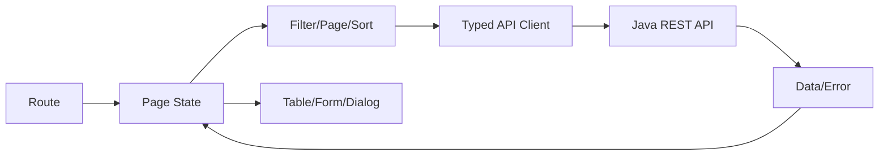

# Vue 3、TypeScript 与后台管理界面

管理页面常常同时有筛选条件、分页、表单和弹窗。难点不只是把控件画出来，而是数据变化后哪些区域该更新、请求失败后怎样反馈。下面用组件和状态的关系组织这些交互。

后台界面以组件、状态和 API 契约组织表格、表单、分页、对话框和权限反馈，重点是可维护状态流与可访问交互。

## 1. 本文覆盖范围

- Composition API 与响应式
- 组件和状态
- 表格/表单/分页/对话框
- 路由、权限与错误体验

## 2. 核心知识详解

### 1. 响应式和组件

`ref/reactive/computed/watch` 表达状态、派生值和副作用；props 向下、event 向上，composable 复用有生命周期的逻辑。

- computed 保持纯粹，watch 处理受控副作用。
- 列表 key 使用稳定业务 id。
- 组件卸载时清理 timer、listener 和 request。

**这里容易混淆的是：** 解构 reactive 对象可能丢失响应连接；按 Vue 规则使用 toRefs 或直接访问。

### 2. 服务端状态

请求状态包含 loading、data、empty、error、stale 和 retry，不能只用一个数组。缓存 key 包含过滤、页码、排序和租户。

- 请求竞态使用 abort 或序列号丢弃旧响应。
- 乐观更新有回滚和冲突反馈。
- Pinia 保存跨页面客户端状态，不复制所有服务端数据。

**这里容易混淆的是：** 后返回的旧请求覆盖新筛选结果是常见竞态，必须主动处理。

### 3. 管理组件

表单 schema、前后端校验、字段错误与提交状态统一；表格服务端分页/排序；对话框处理 focus trap、Esc、确认和异步关闭。

- 分页使用稳定排序并显示总数语义。
- 导入显示逐行错误和可下载报告。
- 危险操作二次确认并明确对象和影响。

**这里容易混淆的是：** 前端校验用于体验，服务端仍执行完整校验和授权。

### 4. 路由和权限

路由 meta 可控制菜单和进入体验，权限指令控制显示；最终授权由后端业务动作决定。

- 401 引导登录，403 说明权限不足，409 表示冲突，422/400 显示字段问题。
- 动态菜单来源需验证并有兜底路由。
- 错误边界和全局通知避免静默失败。

**这里容易混淆的是：** 隐藏菜单、按钮或路由守卫都不是安全边界。

## 3. 工程链路



## 4. 最小可运行示例

先用这段原生表单理解提交事件和数据读取，再与 Vue 的绑定与事件处理对照。它本身不是 Vue 单文件组件。两种写法最终都要处理校验、重复提交和错误反馈，框架不会自动决定这些业务行为。

```html
<form id="search">
  <label for="keyword">关键字</label>
  <input id="keyword" name="keyword" required minlength="2">
  <button type="submit">搜索</button>
</form>
<script type="module">
  const form = document.querySelector('#search')
  form.addEventListener('submit', event => {
    event.preventDefault()
    const data = new FormData(form)
    console.log(data.get('keyword'))
  })
</script>
```

## 5. 实践与验证

1. 实现带筛选、服务端排序、分页和竞态取消的列表。
2. 实现表单 400/409/403 错误映射。
3. 用键盘完整操作对话框和表格动作。

## 6. 掌握检查

- [ ] 能管理请求状态。
- [ ] 能防旧响应覆盖。
- [ ] 能构建可访问管理组件。
- [ ] 能区分 UI 权限和后端授权。

## 参考资料

- [Vue.js Guide](https://vuejs.org/guide/introduction.html)
- [TypeScript Handbook](https://www.typescriptlang.org/docs/handbook/intro.html)
- [Pinia Documentation](https://pinia.vuejs.org/)
