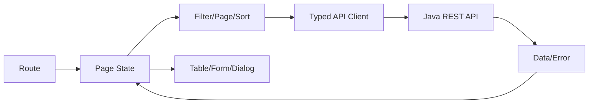

# Vue 3、TypeScript 与后台管理界面

管理页面常常同时有筛选条件、分页、表单和弹窗。难点不只是把控件画出来，而是数据变化后哪些区域该更新、请求失败后怎样反馈。下面用组件和状态的关系组织这些交互。

后台界面以组件、状态和 API 契约组织表格、表单、分页、对话框和权限反馈，重点是可维护状态流与可访问交互。

## 1. 本文覆盖范围

- Composition API 与响应式
- 组件和状态
- 表格/表单/分页/对话框
- 路由、权限与错误体验

## 2. 核心知识详解

### 1. 响应式和组件

`ref/reactive/computed/watch` 表达状态、派生值和副作用；props 向下、event 向上，composable 复用有生命周期的逻辑。

- computed 保持纯粹，watch 处理受控副作用。
- 列表 key 使用稳定业务 id。
- 组件卸载时清理 timer、listener 和 request。

**这里容易混淆的是：** 解构 reactive 对象可能丢失响应连接；按 Vue 规则使用 toRefs 或直接访问。

### 2. 服务端状态

请求状态包含 loading、data、empty、error、stale 和 retry，不能只用一个数组。缓存 key 包含过滤、页码、排序和租户。

- 请求竞态使用 abort 或序列号丢弃旧响应。
- 乐观更新有回滚和冲突反馈。
- Pinia 保存跨页面客户端状态，不复制所有服务端数据。

**这里容易混淆的是：** 后返回的旧请求覆盖新筛选结果是常见竞态，必须主动处理。

### 3. 管理组件

表单 schema、前后端校验、字段错误与提交状态统一；表格服务端分页/排序；对话框处理 focus trap、Esc、确认和异步关闭。

- 分页使用稳定排序并显示总数语义。
- 导入显示逐行错误和可下载报告。
- 危险操作二次确认并明确对象和影响。

**这里容易混淆的是：** 前端校验用于体验，服务端仍执行完整校验和授权。

### 4. 路由和权限

路由 meta 可控制菜单和进入体验，权限指令控制显示；最终授权由后端业务动作决定。

- 401 引导登录，403 说明权限不足，409 表示冲突，422/400 显示字段问题。
- 动态菜单来源需验证并有兜底路由。
- 错误边界和全局通知避免静默失败。

**这里容易混淆的是：** 隐藏菜单、按钮或路由守卫都不是安全边界。

## 3. 工程链路



## 4. 教学示例：在 Vue 中连接输入、状态和列表

在已经建立的 Vue 3 + Vite + TypeScript 项目中，把下面整段保存为 `src/App.vue`，保留脚手架的入口文件，再运行开发服务。这是完整的单文件组件；它没有调用后端，所以先排除网络和权限干扰，专心看数据怎样驱动界面。

```vue
<script setup lang="ts">
import { computed, ref } from 'vue'

const articles = [
  { id: 'html', title: 'HTML 页面结构' },
  { id: 'vue', title: 'Vue 响应式入门' },
  { id: 'react', title: 'React 状态入门' },
]
const query = ref('')
const input = ref<HTMLInputElement | null>(null)
const visibleArticles = computed(() => {
  const word = query.value.trim().toLowerCase()
  return articles.filter(article =>
    article.title.toLowerCase().includes(word)
  )
})
function clearSearch() {
  query.value = ''
  input.value?.focus()
}
</script>

<template>
  <main class="page">
    <h1>文章搜索</h1>
    <label for="query">搜索标题</label>
    <input id="query" ref="input" v-model="query" type="search" autocomplete="off">
    <button type="button" @click="clearSearch">清空</button>
    <p role="status">找到 {{ visibleArticles.length }} 篇文章</p>
    <ul>
      <li v-for="article in visibleArticles" :key="article.id">
        {{ article.title }}
      </li>
    </ul>
    <p v-if="visibleArticles.length === 0">没有匹配的文章，换一个词试试。</p>
  </main>
</template>

<style scoped>
.page { font: 1rem/1.7 system-ui; max-width: 42rem; margin: 2rem auto; padding: 0 1rem; }
input, button { font: inherit; padding: .5rem; }
input { max-width: 100%; box-sizing: border-box; }
</style>
```

输入 `vue` 后只剩 Vue 那一项；清空后恢复三项并把焦点移回搜索框。`query` 保存用户输入，`computed` 从输入计算结果，模板描述结果怎样显示。你没有手工删除旧 `li` 再创建新 `li`，框架负责把新状态反映到 DOM。`ref<HTMLInputElement | null>` 则用于真实输入元素，挂载前允许为空，不能把它当成搜索文字。

这段例子是列表筛选，不包含服务端分页。接上接口时，需要明确加载、失败和空结果三种状态，并处理旧请求晚到。若对 HTML、CSS 和 Vue 的关系还不熟，先到“前端架构 → 从网页基础开始”完成六篇入门课，再回来做后台管理页面。

## 5. 实践与验证

1. 实现带筛选、服务端排序、分页和竞态取消的列表。
2. 实现表单 400/409/403 错误映射。
3. 用键盘完整操作对话框和表格动作。

## 6. 掌握检查

- [ ] 能管理请求状态。
- [ ] 能防旧响应覆盖。
- [ ] 能构建可访问管理组件。
- [ ] 能区分 UI 权限和后端授权。

## 参考资料

- [Vue.js Guide](https://vuejs.org/guide/introduction.html)
- [TypeScript Handbook](https://www.typescriptlang.org/docs/handbook/intro.html)
- [Pinia Documentation](https://pinia.vuejs.org/)
