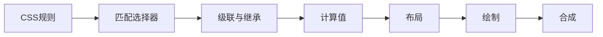

# CSS：级联、盒模型、布局、响应式与动画

样式没有生效时，继续加 `!important` 可能暂时解决问题，却让后续更难调整。先查哪条规则生效，再看盒模型和布局。下面从浏览器怎样决定尺寸与位置讲起，再处理手机布局和动画。

CSS 是一套声明式约束系统。浏览器为每个元素计算属性，再执行布局、绘制与合成。理解级联和布局算法，比不断增加选择器优先级更可靠。

## 1. 学习目标

- 掌握选择器、继承、级联层和自定义属性
- 掌握盒模型、常规流与定位
- 掌握 Flexbox、Grid 和容器/媒体查询
- 理解过渡、动画、性能与减少动态偏好

## 2. 核心概念

### 1. 级联与值处理

同一属性冲突时，来源与重要性、cascade layer、选择器优先级、作用域接近度和源码顺序依次参与决策。部分属性继承。自定义属性保存 token 并在使用点通过 `var()` 解析。

**这里容易混淆的是：** `!important` 参与级联但会提高覆盖成本；应先设计层级与组件边界。

### 2. 盒模型与格式化上下文

content、padding、border、margin 组成盒模型；`box-sizing:border-box` 让声明宽高包含内边距和边框。块级常规流、行内格式化、绝对定位和 stacking context 各有规则。

**这里容易混淆的是：** `z-index` 只在相关层叠上下文内比较；增加极大数值不能跨越祖先上下文。

### 3. Flexbox 与 Grid

Flexbox 面向一个主轴分配空间，适合工具栏和一维组件；Grid 同时定义行列轨道，适合页面和二维卡片。`min-width:auto` 可能阻止 flex 子项收缩，可按需设 `min-width:0`。

**这里容易混淆的是：** 二者可组合，不存在 Grid 永远替代 Flexbox。

### 4. 响应式与动画

移动优先从窄布局开始，用媒体查询响应视口，用容器查询响应组件容器。相对单位、`clamp()`、Grid auto-fit 可形成流式布局。动画优先改变 transform/opacity，并尊重 `prefers-reduced-motion`。

**这里容易混淆的是：** 响应式不等于按设备型号列断点；断点应由内容开始失效的位置决定。

## 3. 运行链路



## 4. 最小示例

```css
@layer reset, base, components, utilities;

@layer base {
  :root {
    --space: clamp(0.75rem, 2vw, 1.5rem);
    --surface: rgb(255 255 255 / 88%);
  }
  *, *::before, *::after { box-sizing: border-box; }
  body { margin: 0; font-family: system-ui, sans-serif; }
}

@layer components {
  .cards {
    display: grid;
    grid-template-columns: repeat(auto-fit, minmax(min(100%, 18rem), 1fr));
    gap: var(--space);
  }
  .card {
    container-type: inline-size;
    padding: var(--space);
    background: var(--surface);
    backdrop-filter: blur(8px);
  }
  @container (min-width: 28rem) {
    .card__body { display: grid; grid-template-columns: 8rem 1fr; }
  }
}

@media (prefers-reduced-motion: reduce) {
  *, *::before, *::after { scroll-behavior: auto; animation-duration: 0.01ms !important; }
}
```

## 5. 练习与验证

1. 不用固定高度实现等高卡片
2. 检查一个 z-index 失效案例的层叠上下文
3. 在 320px 到宽屏连续测试布局

## 6. 常见误区

- 用 absolute 定位完成主要页面布局
- 固定像素宽导致缩放溢出
- 动画触发布局抖动且忽略减少动态偏好

## 7. 掌握检查

页面横向溢出时，怎样判断是宽度、盒模型还是布局规则造成的？请用开发者工具找出来源。

先不看答案，用本章示例解释一遍；再改变一个输入或配置，检查实际结果是否符合你的判断。

## 参考资料

- [MDN CSS Styling basics](https://developer.mozilla.org/en-US/docs/Learn_web_development/Core/Styling_basics)
- [MDN CSS layout](https://developer.mozilla.org/en-US/docs/Learn_web_development/Core/CSS_layout)
- [CSS Cascading Level 6](https://www.w3.org/TR/css-cascade-6/)
