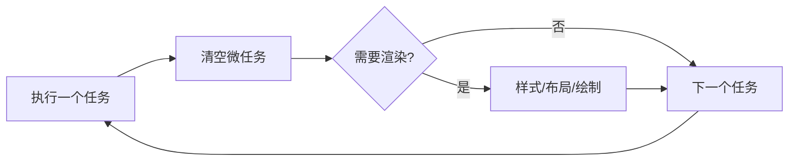

# JavaScript 高级：异步、模块、网络与性能

用户快速切换筛选条件，旧请求却比新请求晚返回，界面该显示哪一份结果？这类问题需要理解异步执行、取消和状态更新。下面从事件循环出发，再联系模块、网络和页面性能。

高级前端的关键不是更多语法，而是正确管理并发、取消、错误、模块边界、缓存与主线程预算。浏览器事件循环保证一段 JavaScript 任务不会被另一段任务中途打断，但长任务会阻塞交互与渲染。

## 1. 学习目标

- 理解任务、微任务、Promise 和 async/await
- 掌握 ES Modules 与动态导入
- 正确使用 fetch、AbortController 与流
- 理解渲染性能、Web Worker 和内存清理

## 2. 核心概念

### 1. 事件循环与 Promise

任务执行完后，浏览器清空微任务队列，再获得渲染机会。Promise 的 then/catch/finally 回调进入微任务。`async` 函数总返回 Promise，`await` 暂停该函数并把后续安排为微任务。

**这里容易混淆的是：** `await` 不阻塞线程，但顺序 await 独立请求会串行；可用 Promise.all 并发并明确失败策略。

### 2. 模块

ES Modules 使用静态 import/export，模块默认严格模式并具有单例绑定语义。动态 `import()` 支持按需加载；循环依赖可能看到尚未初始化的绑定，应重构依赖方向。

**这里容易混淆的是：** 代码分割减少首包但增加网络请求和异步边界，需结合预加载与缓存。

### 3. Fetch、取消与错误

`fetch` 收到了响应，不等于业务请求成功。HTTP 404/500 通常仍会兑现为 `Response`，需要检查 `ok` 或 `status`。网络故障、请求取消，以及某些无效地址、选项或权限限制则可能让 Promise 拒绝；读取响应体时也可能另行失败。

实际界面可以分两层处理：先判断有没有拿到可用的 HTTP 响应，再判断返回的数据是否满足业务要求。用 `AbortController` 取消过期搜索请求时，将取消与真正的服务故障区分展示。响应体是流，读完后再调用另一个读取方法通常会出错；确需两份时，在消费前考虑 `clone()` 及其缓冲成本。参见 [MDN fetch](https://developer.mozilla.org/en-US/docs/Web/API/Window/fetch)。

**这里容易混淆的是：** 取消客户端等待不保证服务端业务回滚；写请求仍需幂等和状态查询。

### 4. 性能与并行

长任务阻塞输入和渲染。先减少工作和 DOM 变更，再分块或把纯计算移入 Worker。Performance 面板、Long Tasks、Web Vitals 和内存快照用于建立证据。

**这里容易混淆的是：** Web Worker 不能直接访问 DOM，消息传递也有复制/转移成本。

## 3. 运行链路



## 4. 最小示例

```typescript
type ApiError = { type: string; title: string; status: number; detail?: string }

async function requestJson<T>(url: string, signal: AbortSignal): Promise<T> {
  const response = await fetch(url, {
    headers: { Accept: 'application/json' },
    signal,
  })
  if (!response.ok) {
    const problem = (await response.json()) as ApiError
    throw new Error(`${problem.status}: ${problem.title}`)
  }
  return (await response.json()) as T
}

let current: AbortController | undefined
async function search(keyword: string) {
  current?.abort()
  current = new AbortController()
  return requestJson<readonly string[]>(
    `/api/search?q=${encodeURIComponent(keyword)}`,
    current.signal,
  )
}
```

## 5. 练习与验证

1. 预测任务/微任务日志顺序再运行验证
2. 同时请求两个独立接口并分别处理部分失败
3. 取消快速输入产生的旧搜索请求

## 6. 常见误区

- 认为 fetch 遇到 500 会自动抛错
- 无 catch 的后台 Promise 产生未处理拒绝
- 在主线程同步处理巨大 JSON/图片

## 7. 掌握检查

连续发起两次搜索，旧请求晚返回时怎样避免覆盖新结果？取消与忽略过期结果有何区别？

先不看答案，用本章示例解释一遍；再改变一个输入或配置，检查实际结果是否符合你的判断。

## 参考资料

- [MDN Asynchronous JavaScript](https://developer.mozilla.org/en-US/docs/Learn_web_development/Extensions/Async_JS)
- [MDN Using Fetch](https://developer.mozilla.org/en-US/docs/Web/API/Fetch_API/Using_Fetch)
- [MDN JavaScript Modules](https://developer.mozilla.org/en-US/docs/Web/JavaScript/Guide/Modules)
