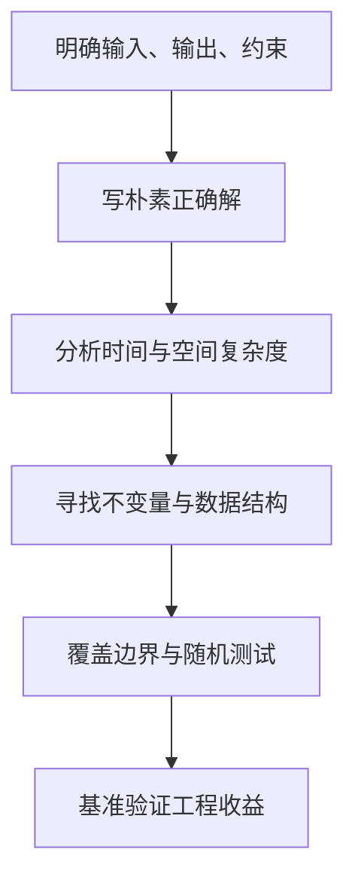

# 数据结构、算法复杂度与工程化解题方法

数据量从一百条变成一百万条，同一段代码的耗时可能增长很多。复杂度帮助我们提前估计这种变化。先用集合查找、排序和分页这样的熟悉问题理解，再练习算法，不必从背模板开始。

数据结构决定数据如何组织，算法决定如何变换数据。后端开发并非每天手写红黑树，但需要用复杂度判断集合选择、分页、缓存、调度和热点路径是否会随数据量失控。

## 1. 学习目标

- 掌握时间/空间复杂度与摊还分析
- 理解线性表、栈、队列、哈希、树、堆、图
- 掌握排序、查找、递归、回溯、贪心和动态规划的适用边界

## 2. 核心概念

### 1. 复杂度与输入规模

大 O 描述输入规模增长时资源消耗的上界增长级别，忽略常数与低阶项；Ω 描述下界，Θ 描述紧确界。复杂度必须说明 n 的含义。哈希表平均查找接近 O(1)，但碰撞、扩容和恶意输入会改变成本。

**这里容易混淆的是：** 复杂度不是实际毫秒数；性能决策还要用真实数据、缓存局部性、分配和 I/O 基准验证。

### 2. 线性结构与哈希

数组支持 O(1) 随机访问但中间插入需移动；链表定位第 k 项为 O(n)；栈遵循后进先出，队列遵循先进先出；哈希表用散列函数定位桶并处理冲突。Java 的 ArrayList、ArrayDeque、HashMap 是常用实现。

**这里容易混淆的是：** Java 的 Stack 是较旧同步类，栈/队列通常优先 ArrayDeque；HashMap 不保证业务所需顺序。

### 3. 树、堆与图

二叉搜索树维持有序关系，平衡树控制高度；堆只保证根为最小/最大，适合优先队列；图用顶点和边表达网络、依赖与路径，可用 BFS 求无权最短层数、DFS 做遍历与环检测。

**这里容易混淆的是：** 堆不是全排序结构；从 PriorityQueue 迭代得到的顺序不保证有序。

### 4. 解题模式

双指针和滑动窗口减少重复扫描；前缀和换取区间查询；二分要求单调判定；回溯枚举决策树；动态规划需要定义状态、转移、初值和计算顺序；贪心需要交换论证或不变量。

**这里容易混淆的是：** 看到“最优”不代表一定使用动态规划或贪心，先证明重叠子问题、最优子结构或贪心选择性质。

## 3. 运行链路



## 4. 最小示例

```java
static int[] twoSum(int[] values, int target) {
  Map<Integer, Integer> seen = new HashMap<>();
  for (int i = 0; i < values.length; i++) {
    int needed = target - values[i];
    Integer j = seen.get(needed);
    if (j != null) return new int[] {j, i};
    seen.putIfAbsent(values[i], i);
  }
  return new int[0];
}
```

该实现一次扫描，平均时间 O(n)、额外空间 O(n)。`putIfAbsent` 保留重复值场景中的较早位置；仍需测试空数组、无解、负数和溢出边界。

## 5. 练习与验证

1. 实现 LRU 缓存并证明 get/put 的复杂度
2. 用 BFS 求网格最短路径并记录访问集合
3. 为排序实现做随机差分测试

## 6. 常见误区

- 背题型而不写不变量
- 只写平均复杂度而忽略最坏情况
- 递归未考虑栈深度和重复计算

## 7. 掌握检查

数据量扩大十倍后，线性查找与排序的工作量怎样变化？请说明估计方法，而不只背复杂度名称。

先不看答案，用本章示例解释一遍；再改变一个输入或配置，检查实际结果是否符合你的判断。

## 参考资料

- [Java Collections Framework](https://docs.oracle.com/en/java/javase/25/docs/api/java.base/java/util/doc-files/coll-overview.html)
- [Princeton Algorithms](https://algs4.cs.princeton.edu/home/)
