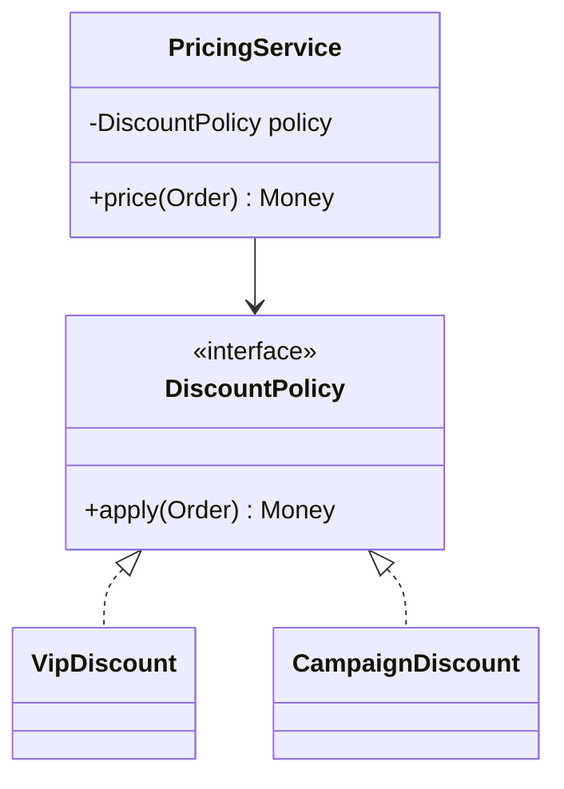

# 设计原则、UML 与常用设计模式

当一个新需求要改很多不相关的类时，设计原则和模式才有了具体用处。下面从变化怎样传播来理解它们，再用 UML 帮助说明关系。能用更少概念把问题说清，通常比套上更多模式更好。

设计的目标是让变化被限制在清晰边界内。原则帮助评审权衡，UML 提供沟通记号，模式记录反复出现的设计结构；三者都服务于具体问题，而不是为了增加类数量。

## 1. 学习目标

- 理解高内聚、低耦合与 SOLID
- 能读写必要的类图和时序图
- 掌握工厂、策略、适配器、装饰器、观察者、模板方法、责任链

## 2. 核心概念

### 1. SOLID 与依赖方向

单一职责关注变化原因；开闭原则鼓励扩展而非散布修改；里氏替换要求子类型保持父类型可观察契约；接口隔离避免客户端依赖无关方法；依赖倒置让高层策略依赖稳定抽象。

**这里容易混淆的是：** 原则会冲突且有成本，应结合变化频率、测试和理解成本权衡，不是每个类都必须套接口。

### 2. UML 的最小集合

类图表达类型、关联、组合、继承和依赖；时序图表达参与者之间随时间发生的消息；状态图表达状态、事件、守卫与迁移。工程文档只画支撑决策的层级。

**这里容易混淆的是：** 图应与代码和运行事实同步；过度精细的全量类图很快过期。

### 3. 创建与结构模式

工厂集中对象创建与选择；适配器把既有接口转换为所需端口；装饰器保持接口同时叠加行为；外观为复杂子系统提供窄入口。

**这里容易混淆的是：** 依赖注入容器可以管理创建，但不会自动决定正确的领域抽象。

### 4. 行为模式

策略把可替换算法封装为统一接口；观察者广播事件但要处理顺序与失败；责任链让多个处理器依次判断；模板方法固定骨架并允许步骤变化。

**这里容易混淆的是：** 进程内观察者与可靠消息不是同一保证；异常、线程和事务传播需要明确。

## 3. 运行链路



## 4. 最小示例

```java
interface DiscountPolicy {
  BigDecimal apply(Order order);
}

final class PricingService {
  private final DiscountPolicy policy;
  PricingService(DiscountPolicy policy) { this.policy = policy; }

  BigDecimal finalPrice(Order order) {
    return order.total().subtract(policy.apply(order)).max(BigDecimal.ZERO);
  }
}
```

## 5. 练习与验证

1. 把多分支支付逻辑重构为策略并比较修改面
2. 为一次下单画组件时序图
3. 识别一个不必要的模式并简化

## 6. 常见误区

- 把“一个类只做一件事”机械等同于单一职责
- 用继承复用实现却破坏替换契约
- 模式名称先于问题分析

## 7. 掌握检查

遇到一个变化需求，现有代码需要改哪些类？引入模式后是否真的缩小了修改范围？

先不看答案，用本章示例解释一遍；再改变一个输入或配置，检查实际结果是否符合你的判断。

## 参考资料

- [Refactoring.Guru Design Patterns](https://refactoring.guru/design-patterns)
- [PlantUML Class Diagram](https://plantuml.com/class-diagram)
