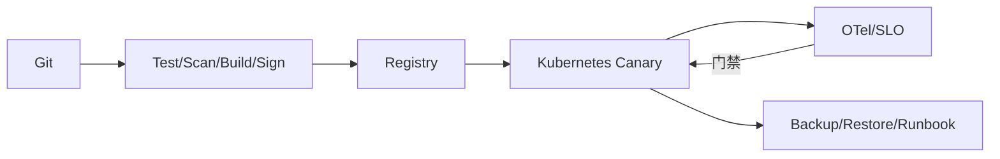

# 项目三：云原生高可用服务平台

把前面的应用搬进 Kubernetes 后，练习重点转向运行过程：发布时是否中断，实例失效后怎样恢复，数据库和外部依赖是否成为瓶颈。高可用不是部署多个副本就结束，还需要实际验证。

把前两个项目部署到 Kubernetes，加入渐进发布、OpenTelemetry、SLO、安全供应链和故障演练，形成生产级交付证据。

## 1. 本文覆盖范围

- Kubernetes 与资源治理
- CI/CD 与迁移
- 可观测/SLO/值班
- 安全与灾难恢复

## 2. 核心知识详解

### 1. 平台部署

使用不可变签名镜像、Deployment/Stateful 依赖、Service/Gateway、Secret、NetworkPolicy 和 autoscaling。

- 多可用区分布。
- requests/limits 和连接预算。
- 探针与优雅停机。

**这里容易混淆的是：** 副本数增加不等于高可用，下游、控制面和故障域仍需设计。

### 2. 发布和数据

流水线 build once，自动测试扫描，canary 按 SLI 晋级；数据库使用 expand/contract，事件 schema 兼容。

- 制品可追溯。
- 发布有回滚/前向修复。
- 迁移可暂停和重入。

**这里容易混淆的是：** 镜像回滚不能撤销 schema 和外部副作用。

### 3. SRE 闭环

OTel 收集日志、指标和 trace，SLO/error budget 驱动告警与发布；runbook、演练和复盘改进系统。

- 业务与技术 SLI。
- 多窗口 burn-rate。
- 事故角色和时间线。

**这里容易混淆的是：** 仪表盘多不代表可运营，关键是用户导向目标和可行动告警。

### 4. 安全与恢复

OIDC、最小权限、secret rotation、SBOM/签名、备份恢复和跨区域策略构成纵深防护。

- 定期恢复演练验证 RPO/RTO。
- 审计不可由业务管理员篡改。
- 依赖漏洞和密钥泄露有流程。

**这里容易混淆的是：** 有备份文件不等于可恢复，必须执行恢复和数据一致性验证。

## 3. 工程链路



## 4. 最小可运行示例

这段 Command 接口展示应用内的请求组织，不是 Kubernetes 或高可用配置。把业务代码部署到集群后，仍要分别测试发布、探针、资源和故障恢复；一个清楚的接口只能解决其中一小部分问题。

```java
public sealed interface Command permits CreateOrder {}
public record CreateOrder(UUID requestId, long customerId) implements Command {}

public interface CommandHandler<C extends Command, R> {
  R handle(C command);
}
```

## 5. 实践与验证

1. 用 IaC/manifest 从空环境部署。
2. 执行 canary 自动回滚和兼容迁移。
3. 演练节点故障、密钥轮换和数据库恢复并记录 RTO/RPO。

## 6. 掌握检查

- [ ] 环境可重建。
- [ ] 发布可渐进和停止。
- [ ] SLO 可行动。
- [ ] 恢复经过实际验证。

## 参考资料

- [Kubernetes Documentation](https://kubernetes.io/docs/home/)
- [OpenTelemetry Java](https://opentelemetry.io/docs/languages/java/)
- [SLSA](https://slsa.dev/)
- [Kubernetes Security Checklist](https://kubernetes.io/docs/concepts/security/security-checklist/)
