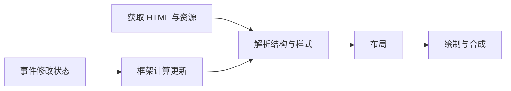

# 浏览器渲染与事件循环：页面为什么会卡住

你在搜索框里打字，字半秒后才出现。接口可能完全没问题：页面正在主线程上处理几万段文本。学框架前先理解这件事，很多“Vue 慢”“React 慢”的争论就能变成具体排查。

## 从 HTML 到能看见的页面

浏览器解析 HTML 建立 DOM，解析样式，计算元素的位置和尺寸，再绘制、合成画面。这些工作会交错进行，不是等所有资源下载完才统一开始。JavaScript 修改 DOM 或样式后，浏览器可能需要重新计算样式、布局或绘制。

在列表中连续执行“改宽度—读取高度—改宽度—读取高度”，可能迫使浏览器反复同步布局。更合理的是先收集需要读取的信息，再集中写入。框架能帮助组织更新，但不能让浏览器免做布局工作。



## 异步并不等于开了另一条计算线程

以下代码可直接在浏览器控制台运行，输出是 A、D、B、C：

```javascript
console.log('A')
setTimeout(() => console.log('C'), 0)
Promise.resolve().then(() => console.log('B'))
console.log('D')
```

同步代码先执行，当前任务结束后处理微任务，计时器回调是后续任务。`0` 表示达到可调度条件，不保证立即执行。浏览器还要选择渲染时机，所以不要从这个例子推导“每跑一个任务必定画一帧”。

`async function` 里的大循环仍会占用所在的 JavaScript 线程；`await Promise.resolve()` 也不保证让浏览器先绘制，因为持续生成微任务可能拖延其他工作。大量文本索引可以移到 Worker，DOM 操作仍留在主线程。Worker 通信还有序列化和传输成本，小计算不一定值得迁移。

## 在知识库里怎么查

先看 Network：文章 JSON 是迟迟没回来，还是早已收到？再看 Performance：是否有长任务、重复布局或大段脚本计算？最后定位功能：是 Markdown 渲染、代码高亮、图表，还是搜索过滤。每次只改一个主要变量再测，否则不知道是哪一步有效。

文章正文可以先显示，非首屏图表稍后加载；搜索可以减少每次处理的数据量。防抖减少执行次数，但单次任务过重仍会卡。不要把“少执行几次”和“每次更快”当成同一件事。

## 练习：让问题可见

在开发工具中降低 CPU 速度，对比 200 条和 20000 条文章标题的本地过滤。记录输入延迟、脚本耗时和 DOM 节点数。预期你会发现数据计算与渲染大量节点是两个不同瓶颈；只加防抖不一定解决两者。

## 继续阅读

- [MDN：浏览器如何工作](https://developer.mozilla.org/en-US/docs/Web/Performance/Guides/How_browsers_work)
- [MDN：JavaScript 执行模型](https://developer.mozilla.org/en-US/docs/Web/JavaScript/Reference/Execution_model)
- [JavaScript.info：事件循环](https://javascript.info/event-loop)
