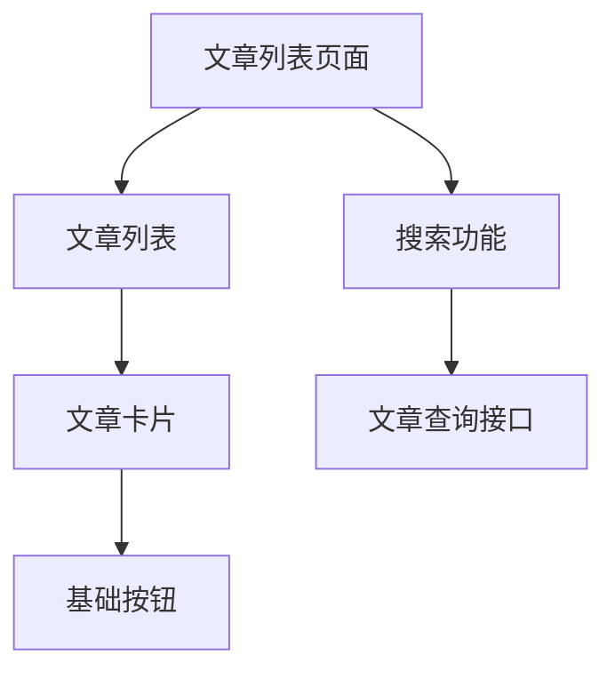

# 组件边界与状态归属：这段代码到底该放哪

文章卡片最初只有标题，后来加上收藏、权限、菜单、编辑弹窗。一不小心，卡片就开始登录、查数据库、刷新整个页面。难维护的原因通常不是组件太大这么简单，而是它同时管了太多不同的事。

## 用一条交互链拆开职责

知识库可以分成页面、功能组件和基础组件。页面知道当前路由与文章列表；搜索功能知道输入、请求和反馈；基础按钮只知道怎样表达禁用、焦点和点击。它们不必每层都再拆五层，先让变化发生在合理位置。

父组件传入数据，子组件报告用户意图。例如卡片发出“请求收藏 articleId”，而不是在内部偷偷改父组件的数据。Vue 可以用 props/emits，React 可以用 props/回调。两种语法都在表达可追踪的数据流。

## 状态放在离使用者足够近的地方

| 数据               | 通常放在哪里 | 原因                       |
| ------------------ | ------------ | -------------------------- |
| 卡片菜单是否展开   | 卡片局部     | 别处不关心                 |
| 搜索关键词与页码   | URL 或页面   | 需要刷新恢复、分享或返回   |
| 当前编辑草稿       | 编辑功能     | 有取消、提交、冲突生命周期 |
| 服务端文章列表     | 查询层缓存   | 涉及过期、失效、重取       |
| 多处需要的主题偏好 | 共享状态     | 多个页面确实共同使用       |

“多个组件用到”不一定就要全局仓库。两个兄弟组件可以先把状态提升到最近共同父组件。也不要同时存 `articles`、`filteredArticles` 和 `filteredCount`，后两者能计算出来时，保存三份反而多出同步义务。

## 拆组件不是按行数切蛋糕

一个 150 行、职责单一的编辑表单，可能比十个相互传二十个参数的小组件更好读。值得提取的信号是：有清楚名字、有独立交互或测试、有稳定的输入输出，或确实重复使用。只有一句模板时，不必为了目录看起来整齐就拆文件。

复用也分两种：重复的视觉结构用组件，重复的状态行为用 composable 或 Hook，纯计算用普通函数。把过滤算法塞进 Hook，反而让本来与框架无关的逻辑难以复用。

## 练习：收藏按钮应该知道什么

写下 ArticleCard 的输入输出：文章摘要、是否收藏、是否提交中，以及收藏请求事件。它不应接收管理员密码，也不应知道数据库表名。再添加“收藏失败，保留原状态”的交互，看看失败处理属于卡片反馈还是页面协调。只要归属清楚，两种实现都可以合理。

## 继续阅读

- [React：Thinking in React](https://react.dev/learn/thinking-in-react)
- [Vue：组件 Props](https://vuejs.org/guide/components/props.html)
- [Vue：组件事件](https://vuejs.org/guide/components/events.html)
