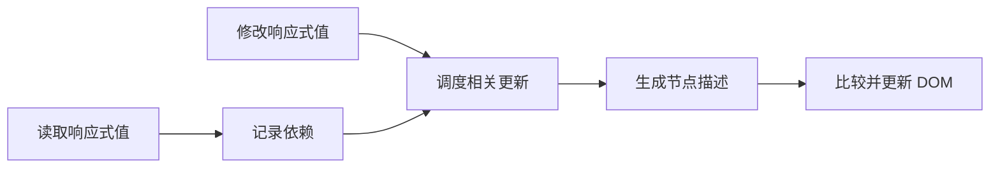

# Vue 的渲染机制：数据改了以后发生什么

知道 `count.value++` 会更新页面还不够。你可能会问：Vue 怎么知道哪个地方用了 count？是不是每次都把整页重新画一遍？理解更新链路，可以帮助你选择优化位置。

## 一条简化的更新链

响应式读取建立依赖关系，写入触发相关工作，调度器组织更新，组件渲染产生新的节点描述，渲染器把变化应用到真实 DOM。这里的“依赖”不是 npm 包，而是“这次计算用到了哪个响应式值”。

这是理解模型，不是源码逐行流程。内部调度策略会随版本演进，应用代码应依赖公开 API 的行为。

## 模板编译器并没有闲着

Vue 模板会编译成渲染代码，编译器能识别静态内容和部分动态变化位置，把信息交给运行时使用。虚拟 DOM 是对界面的一种描述，不是“永远比原生 DOM 更快”的保证。它主要让声明式更新更可组织，真实成本仍取决于数据规模、组件工作量和浏览器布局。

Vue 会批处理更新。同一同步流程连续修改状态，不能据此认定 DOM 已同步变化。需要等本轮更新落到 DOM 再测量时使用 nextTick；这不保证图片也加载完，更不保证浏览器已经完成你想象中的所有绘制。

## key 是身份，不是优化咒语

编辑文章 A 的输入框有未保存内容。切换到 B 时，如果希望复用编辑器并显式载入数据，就要设计好重置逻辑；如果希望新文章对应全新实例，可以让组件 key 随文章 ID 改变。换 key 会重建状态，不能作为“刷新一下就好”的常规补丁。

列表同级 key 需要唯一且稳定。随机数每次变化，会让旧节点失去身份并造成不必要的卸载和创建。数组下标在永不重排的静态列表可能无害，但可排序文章列表应使用业务 ID。

## 优化前先问是哪一段慢

响应式追踪很细，并不意味着 10000 个文章卡片就没有成本。可以先分页或虚拟滚动，再考虑减少不必要的 props 变化、按需加载重型编辑器。大型只读结构适合评估 shallowRef，但改用浅层响应式后，内部修改不会自动产生同样的更新语义，需要整体替换等明确策略。

KeepAlive 缓存组件实例，代价是状态和资源继续存在。订阅或轮询是否需要在停用时暂停，要独立考虑。缓存不是免费性能提升，也可能让过期数据更难察觉。

## 练习与参考

给列表中的输入框填字，再反转列表，分别用下标 key 和文章 ID key 观察。能解释“文字为什么跟错行”，就比背诵 diff 名词更接近理解。

- [Vue：渲染机制](https://vuejs.org/guide/extras/rendering-mechanism.html)
- [Vue：深入响应式系统](https://vuejs.org/guide/extras/reactivity-in-depth.html)
- [Vue：性能](https://vuejs.org/guide/best-practices/performance.html)

## 把“响应式”拆成可以观察的三件事

先有状态读取，Vue 知道当前相关工作依赖哪个值；再有写入，触发与该值有关的更新；最后调度和渲染把界面落实到 DOM。它不意味着浏览器认识 ref，也不意味着修改所有 JavaScript 对象都会被 Vue 接管。

在一个按钮事件中连续增加 count 三次，紧接着读取 state 和 DOM 文本。状态值已经变化，DOM 可能仍等待批处理；await nextTick() 后再读，应该与相应更新一致。这个实验说明“状态变化时刻”“框架提交时刻”“浏览器显示时刻”不是同一个概念。

列表 key 实验要包含本地状态才看得清：给每行一个没有由数组值完全控制的输入框，输入文字，再反转列表。下标 key 让身份与位置绑定，业务 ID key 让身份与记录绑定。纯文本列表可能看起来都正确，因此不能只用纯文本截图验证身份设计。

如果卡顿来自一万个节点，先减少实际显示数量。如果卡顿来自重复深层对象处理，再评估 shallowRef 或数据归一化。优化后重新测量相同数据和设备，确认没有以丢失更新或错误复用状态换取表面上的速度。
