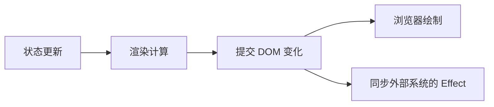

# React 渲染、提交与性能：重渲染不等于重画整页

控制台里的组件日志又打印了一次，很多人立刻开始加 memo。先慢一点：函数再次执行，和整个 DOM 被销毁重建，并不是一回事。判断性能需要看实际工作量和用户感受到的延迟。

## 渲染负责计算，提交负责落地

渲染阶段调用组件，计算界面描述；提交阶段把需要的变化应用到 DOM。浏览器随后进行自己的布局、绘制工作。React 可以中断或放弃部分渲染工作，因此渲染必须保持纯净，不能在函数体里发送“发布文章”请求。

这张图强调职责，不承诺每次 Effect 都严格在浏览器绘制之后执行。具体时序与交互和 Hook 类型有关，测量布局时应理解 useLayoutEffect 的阻塞成本。

## 状态和树中的身份有关

React 按组件在树中的位置、类型和 key 等信息维持身份。切换文章但复用同一编辑组件时，旧草稿可能保留；给编辑器设置 `key={article.id}` 可以表达“换文章就换实例”。但也会丢失该实例的其他状态，必须符合产品预期。

不要在父组件函数体里定义新的组件类型，再把它当普通子组件渲染；每次渲染都生成新的函数身份，可能导致意外重置。组件定义通常放到模块层，变化的数据通过 props 传入。

## memo、useMemo、useCallback 各管一点事

memo 可以在条件满足时跳过因父级更新引起的子组件渲染；useMemo 缓存计算结果；useCallback 缓存函数引用。它们有比较、缓存和理解成本，不能修复错误的数据流，也不应该成为保证业务正确性的依赖。

在默认比较下，每轮新建的对象或函数 props 可能使 memo 的收益消失。先把状态放近使用者、减少不必要的 Effect 链，往往比到处包缓存更有效。React Compiler 能在适用的配置和代码条件下自动完成部分优化；它需要明确集成，不能假定所有项目都已启用，也不能省掉性能测量。

## 并发能力不是多开一条 JS 线程

useTransition 可把部分状态更新标为非紧急，让紧急交互优先；useDeferredValue 允许较重内容暂时使用滞后的值。它们不自动减少网络请求，不是防抖，也不能中断你随手写的一大段同步循环。受控输入本身的更新应保持及时，耗时结果展示再按需降优先级。

## 练习与参考

用 React DevTools Profiler 记录输入搜索词时哪些组件工作最久。先把输入状态从整页顶层移到搜索功能边界，再测是否改善。只有数据证明昂贵计算重复发生时，再尝试 useMemo 并比较前后。

- [React：Render and Commit](https://react.dev/learn/render-and-commit)
- [React：状态保留与重置](https://react.dev/learn/preserving-and-resetting-state)
- [React：useTransition](https://react.dev/reference/react/useTransition)
- [React：memo](https://react.dev/reference/react/memo)
