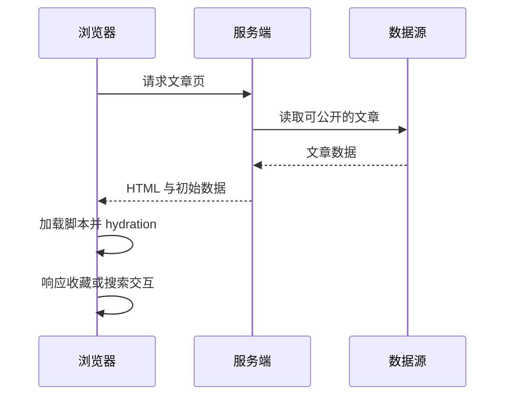

# CSR、SSR、SSG 与 Hydration：页面在哪里生成

打开知识库，先看到一块空壳，过一会儿正文才出现；另一个网站几乎马上就有文字，但按钮晚一点才可点。它们可能选择了不同的渲染方式。先区分“看见内容”和“可以交互”，再讨论哪种适合。

## 三种生成 HTML 的时机

| 方式 | 主要生成时机       | 适合讨论的场景               | 需要承担的成本             |
| ---- | ------------------ | ---------------------------- | -------------------------- |
| CSR  | 浏览器加载脚本之后 | 强交互后台、客户端工具       | 首屏脚本与请求等待         |
| SSR  | 服务端收到请求时   | 动态公开内容、按请求生成页面 | 服务端计算、缓存与请求隔离 |
| SSG  | 构建阶段           | 更新较少的文档、营销页面     | 内容更新后的重新生成       |

这些方案可以混用。公开文章采用预渲染或 SSR，编辑器采用客户端交互，并不矛盾。SSR 也可能附带很多 JavaScript，不能仅凭三个字母判断性能；SSG 也可以在客户端继续获取动态数据。

## Hydration 是把交互接到已有 HTML 上

服务端先输出 HTML，客户端再用相匹配的数据和组件结构接管。若服务端输出时间 A、客户端第一次渲染用时间 B，或者服务器无登录信息而客户端直接展示用户菜单，就可能出现 hydration mismatch。

随机数、时区格式、无效 HTML 嵌套、浏览器扩展都可能造成首屏不一致。不要只压制警告，应定位两端初次输出为何不同。仅客户端需要的能力放到合适生命周期，且设计服务端占位输出。

## 服务器环境不是浏览器

SSR 中没有可直接使用的 window、document、localStorage。模块顶层访问这些对象可能在构建或请求时就崩溃。共享模块中的可变用户状态还可能串请求，应创建请求范围内的状态。

服务端生成页面也不等于可以随意缓存。用户私有文章若被公共 CDN 缓存，可能泄露给其他访客。缓存键、认证上下文和响应头必须配合，公开页面与个人工作区应分别设计策略。

## 怎么选

先列内容是否公开、更新频率、交互强度和部署约束。知识库正文需要直接访问、分享和搜索可见性，通常值得考虑服务端或预生成 HTML；管理员编辑器更关注草稿和交互，客户端逻辑会更多。选型目标是匹配需求，不是争论 SSR 是否“更高级”。

## 练习与参考

在练习页面渲染当前时间，故意让两端时区不同，观察 hydration 警告。随后改为明确传递同一初始值，或先渲染稳定占位再客户端更新，解释各自的用户体验。

- [Vue：服务端渲染](https://vuejs.org/guide/scaling-up/ssr.html)
- [Nuxt 3：渲染模式](https://nuxt.com/docs/3.x/guide/concepts/rendering)
- [React：hydrateRoot](https://react.dev/reference/react-dom/client/hydrateRoot)
