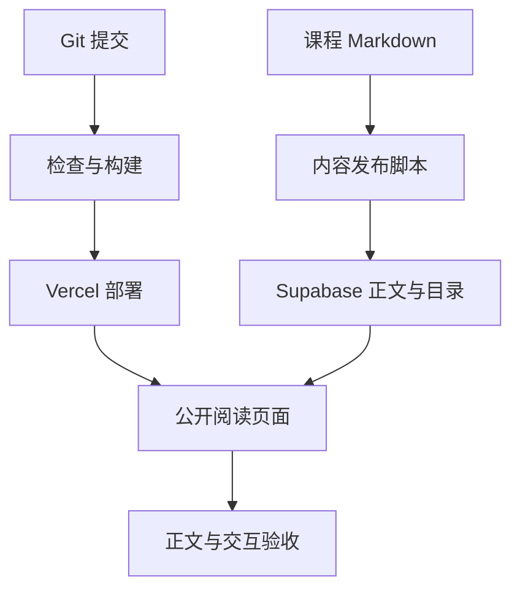

# Vercel 部署与回滚：构建成功之后还要确认什么

本地能打开、云端构建成功、读者真正读到新课程，是三个不同的里程碑。这个知识库尤其如此：页面程序部署在 Vercel，正文来自 Supabase，Git 中的 Markdown 只是课程源文件。

## 把发布拆成两条可核验的链

代码链是检查源码、安装锁定依赖、类型检查与测试、构建、部署，再确认具体提交对应的生产版本。内容链是检查 Markdown、计划新增记录、写入数据库、逐篇比较正文与目录，再从公开页面验证。只完成其中一条，不能说课程已经完整上线。

## 配置按环境核对

Development、Preview、Production 可以有不同变量和数据库目标。预览部署应明确连接哪套数据，尤其不要让一次测试写入污染生产内容。客户端公开配置不能装私钥；服务器密钥也不能提交到 Git 或构建日志。

本项目健康接口会实际查询数据库，只返回简洁状态。它能证明部署运行时访问数据库成功，但不能证明所有文章、权限和页面都正确。健康检查和业务验收互相补充。

## 发布前留下可恢复的证据

记录 Git 提交、部署地址、生产别名、内容发布清单和检查结果。内容导入应只触碰本次范围，保存必要备份，并验证既有记录没有被意外覆盖。脚本重复执行时不应制造重复目录，遇到线上不同版本时应停止并说明冲突。

如果发布脚本中途失败，要能根据稳定身份继续插入尚未完成的记录，而不是清空整个知识库重来。内容没有事务式整体发布时，还要清楚期间可能短暂出现部分章节，并在最终验收中确认完整。

## 回滚两边都要考虑

回退 Vercel 部署只回退程序，不会自动撤销 Supabase 中新写入的文章。反过来，恢复正文也不会撤销坏代码。数据库 schema 变更更需要前后兼容设计；本次增加课程无需修改 schema。

正式发布后检查首页入口、深层文章链接、手机阅读、控制台异常与数据库健康状态。线上日志不要记录完整令牌或文章私密内容。若错误上升，先确定是代码、配置还是数据，再选相应回退方式。

## 练习与参考

写一份四行发布记录：提交号、部署地址、内容校验结果、回退目标。再回答“如果回退代码，新增文章还在不在？”正确答案应考虑程序与数据库是两个独立状态。

- [Vercel：部署](https://vercel.com/docs/deployments)
- [Vercel：环境变量](https://vercel.com/docs/environment-variables)
- [Vercel：回滚](https://vercel.com/docs/instant-rollback)
