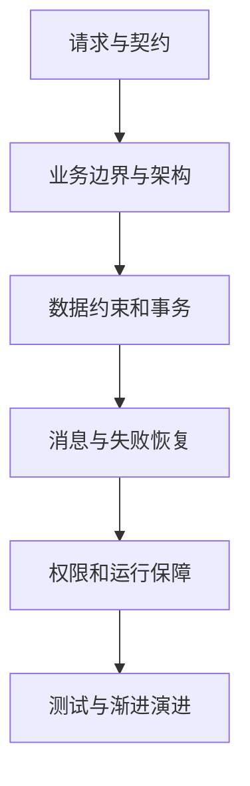

# 后端知识学习路线：从一次请求到一个可靠的服务

点一下“提交订单”，前端只花几行代码就能发出请求。后端却要回答一串问题：用户是谁？库存够不够？钱和数量有没有算错？重复点击怎么办？数据库已经提交、返回结果却丢了怎么办？这个模块围绕这些问题展开，不把学习后端变成背框架名字。

## 1. 先分清这几个词

**后端**是运行在服务端、承担业务处理和数据访问等职责的程序及相关系统。**API**是外部访问这些能力的约定。**数据库**保存需要持久化的状态。**架构**则说明这些职责怎样分开、彼此怎样通信，以及出了故障由谁处理。安装 Redis、Kafka 或 Kubernetes 本身，不构成一份完整架构。

本模块讲跨语言的原理。需要 Spring、JPA、JVM 的具体用法时，接着阅读本站“Java开发”；需要 TypeScript 类型系统时去“语言基础”。这里用同一个订单例子串起不同知识，而不是再复制一套框架手册。

## 2. 推荐学习顺序

| 阶段 | 先回答的问题 | 练习产物 |
|---|---|---|
| 请求与接口 | 一个请求从哪里来，失败怎样表达？ | API 契约、错误响应、超时预算 |
| 常见架构 | 业务逻辑和外部设施放在哪里？ | 分层模块图、接口依赖图 |
| 数据与存储 | 两个人同时下单会发生什么？ | 约束、事务、索引和缓存策略 |
| 分布式与可靠性 | 消息重复、服务超时以后怎么办？ | 幂等记录、Outbox、恢复流程 |
| 身份权限 | 登录以后是否就能查看所有订单？ | 资源归属检查和越权测试 |
| 部署与可观测性 | 新版本怎样发布，错误怎样定位？ | 指标、迁移方案、回滚步骤 |
| 项目实战 | 怎么证明设计确实有效？ | 可运行的小服务与故障实验 |

## 3. 一个贯穿全程的需求

用户购买一种商品，库存减少，订单保存，后台发送确认通知。初版只允许一种货币和整数数量，金额用最小货币单位的整数表示。我们先明确三个约束：库存不为负；一次逻辑下单只生成一个订单；通知可以稍晚发送，但发送失败要有记录并可恢复。

“库存不为负”主要靠数据库约束与原子更新。“只生成一个订单”需要业务幂等与唯一约束。“可恢复通知”需要把待发送事件和订单放在同一事务保存。它们不是同一个问题，也不该都交给一个分布式锁解决。

随后再加入多商品、退款、优惠券、搜索等需求。每加一项，都先画出状态变化和失败路径，再考虑要不要增加组件。这个顺序比先搭十个微服务再找业务更容易发现真正的边界。

## 4. 怎样读示例

文中 SQL 以 PostgreSQL 18 的稳定语法和语义为参照；带 SQLite 标记的项目使用 Python 标准库，适合本机演练，不用它推断 PostgreSQL 的锁或隔离实现。Python 教学项目见仓库 `examples/backend/order_service.py`；它是本机业务核心，不是可直接暴露公网的完整服务器。

代码块会说明是可运行代码、接口草图还是配置示意。架构图描述责任和数据流，不代表每个方框都要单独部署。文章核对日期为 2026-09-22；升级具体产品时仍按目标版本的官方文档验证，不把“最新”当作配置。

## 5. 学完后的自检

给自己的服务画一条完整请求链：入口、鉴权、业务、数据库、消息、响应。对每个箭头问：等待多久？失败会重试吗？重试是否重复扣库存？是否记日志？日志里会泄露什么？

能把这些问题讲清并用测试复现，比记住架构缩写更有用。建议先实现模块化单体，再根据独立扩容、发布频率和组织边界决定是否拆服务，而不是按文章数量决定组件数量。

## 参考资料

- [Microsoft：常见架构风格](https://learn.microsoft.com/en-us/azure/architecture/guide/architecture-styles/)
- [Martin Fowler：Monolith First](https://martinfowler.com/bliki/MonolithFirst.html)
