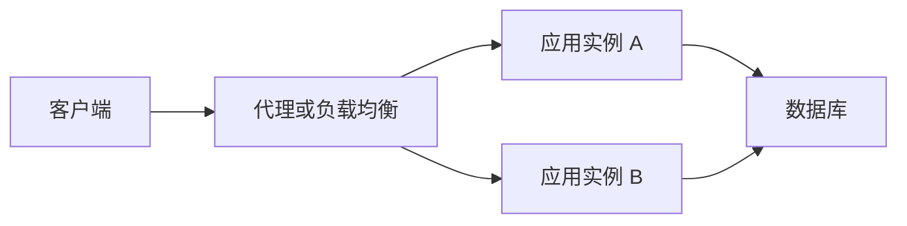

# 一次请求的完整旅程：DNS、TLS、代理与应用

用户看到“页面转圈”，原因可能在网络，也可能是数据库连接池排队。先把请求经过哪些地方弄清，排错才不会只盯着业务函数。

## 1. 后端程序在等什么

服务端进程监听某个地址和端口。客户端找到目标地址后建立连接，再按协议交换数据。域名解析负责把名称映射到地址等信息；TLS 负责通信加密与身份验证；HTTP 规定请求和响应语义。这些机制不等于业务权限检查：连接经过 HTTPS，并不说明这个用户有权查询别人订单。

HTTP/1.1 和 HTTP/2 通常运行在 TCP 上；HTTP/3 使用基于 UDP 的 QUIC。复用连接、DNS 缓存、TLS 会话恢复会改变实际路径，因此并非每个请求都重新经历完整建连过程。

## 2. 反向代理和负载均衡

反向代理代表服务端接收请求，再转交应用。负载均衡是在多个后端之间选择目标；它可以由代理完成，也可能发生在别的网络层。应用有多个实例后，进程内变量只属于当前实例。把登录态或订单状态只放在本机内存，换一个实例就可能读不到。



图里的数据库可以有复制和故障转移，但这些是另一个层面的设计。两台应用连同一个数据库，不代表数据库已经具备高可用。

代理还可能改写路径、终止 TLS、限制请求大小。应用只有在请求确实来自可信代理时，才应采信它传递的客户端地址或协议头。否则用户也可以自己发送同名 Header。

## 3. 应用收到请求以后

典型顺序是请求大小与格式检查、认证、授权、业务校验、事务处理和响应编码。不同框架的中间件安排不完全相同。业务校验应和权限一起发生在服务端，前端校验主要是帮助用户更早发现输入问题。

每一层都可能排队：连接建立、代理队列、应用执行槽位、数据库连接池、行锁。总延迟可拆成等待时间和真正处理时间。CPU 很闲但请求很慢，可能是在等数据库，而不是需要再加 CPU。

下面是本机教学服务器，只演示“接请求—按路径返回响应”，不实现用户系统或持久化。Python 3.11+ 保存为 `server.py` 后运行；只监听回环地址。

```python
from http.server import BaseHTTPRequestHandler, ThreadingHTTPServer
import json

class Handler(BaseHTTPRequestHandler):
    def do_GET(self):
        if self.path != "/health":
            self.send_error(404)
            return
        body = json.dumps({"process": "alive"}).encode("utf-8")
        self.send_response(200)
        self.send_header("Content-Type", "application/json; charset=utf-8")
        self.send_header("Content-Length", str(len(body)))
        self.end_headers()
        self.wfile.write(body)

if __name__ == "__main__":
    ThreadingHTTPServer(("127.0.0.1", 8080), Handler).serve_forever()
```

另开终端执行 `curl -i http://127.0.0.1:8080/health`。这个 health 只证明进程在响应，未证明数据库可用。生产服务还要考虑负载、认证、超时、优雅退出和可信代理配置，标准库示例不承担这些保障。

## 4. 怎样定位慢在哪里

为一次请求分配 request ID，记录入口时间、业务结束时间和数据库耗时。再分别测试代理地址与应用内部地址，判断慢点是否发生在转发之前。不要通过关闭 TLS 或绕过权限来“优化”结果。

用几个受控实验建立直觉：业务函数睡眠一秒；把连接池限制为一个；让两个事务竞争同一行。比较 CPU、排队长度和延迟的变化。三种慢法表现不同，处理方式也不同。

## 自检与参考

为什么两个应用实例并不自动提供共享登录态？为什么 CPU 使用率低仍会超时？试着沿上图解释，而不是只说“服务器卡了”。

- [MDN：HTTP 概览](https://developer.mozilla.org/en-US/docs/Web/HTTP/Overview)
- [Python http.server](https://docs.python.org/3/library/http.server.html)
- [RFC 9110](https://www.rfc-editor.org/rfc/rfc9110.html)
