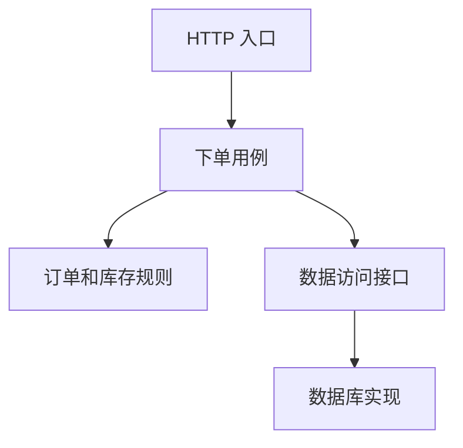

# 分层架构与 MVC：把请求处理和业务规则分开

刚写后端时，最容易把解析参数、查数据库、算价格、发邮件全塞进一个接口函数。功能少时很快，后来换一个入口、加一个优惠规则，就开始担心改坏其他地方。分层的目的，是让变化有明确的位置。

## 1. 一次下单怎样分工

入口层读取请求、建立身份上下文、校验输入形状并转换响应。应用层组织“下单”这个用例，决定事务和调用顺序。领域逻辑表达价格、库存、订单状态等业务规则。数据访问层处理具体存储读写。



这是逻辑职责，不是四台服务器。一个进程里也可以有这些层。物理部署层级常称 tier，代码职责层常称 layer；把它们混为一谈，会误以为“多加一层代码”就得多一次网络调用。

## 2. MVC 不等于完整后端架构

MVC 把界面交互相关职责分为 Model、View、Controller。不同框架对 Model 的范围有差异，它不应被机械理解为“一张数据库表”。JSON API 没有传统 HTML 模板时，仍会有控制器和响应表示，但整个系统还需要事务、授权、消息与后台任务设计。

因此“用了 MVC”没有回答业务边界在哪里。可以让 Controller 很薄，但如果 Service 是一个几万行的大类，业务仍然难维护。层名本身没有约束力，需要接口与测试共同维持规则。

## 3. 看一个职责明确的接口草图

以下 TypeScript 是依赖注入草图，不绑定 Web 框架；`place` 的事务实现位于用例内部。TypeScript 类型在运行时会擦除，所以对外输入要实际检查。

```typescript
interface PlaceOrder {
  place(input: { userId: string; sku: string; quantity: number }): Promise<string>
}

export async function handleOrder(
  body: unknown,
  userId: string,
  service: PlaceOrder,
): Promise<{ status: number; body: { id: string } }> {
  if (typeof body !== 'object' || body === null) throw new Error('invalid body')
  const input = body as Record<string, unknown>
  if (typeof input.sku !== 'string' || input.sku.length === 0 ||
      typeof input.quantity !== 'number' || !Number.isSafeInteger(input.quantity) ||
      input.quantity < 1 || input.quantity > 100) throw new Error('invalid input')
  const id = await service.place({ userId, sku: input.sku, quantity: input.quantity })
  return { status: 201, body: { id } }
}
```

`userId` 必须来自服务端验证后的身份上下文，不从请求正文直接相信。草图里的异常还需由框架适配成约定错误响应，真实订单接口另需幂等键。这里刻意只演示入口不负责 SQL 和扣库存。

## 4. 什么时候分层有帮助

当 HTTP、定时任务、管理工具都要调用同一业务能力时，用例层可以复用；当数据库迁移时，数据访问适配器提供隔离。简单的只读查询可以直接通过专门的查询服务返回 DTO，不必为每张表建立整套空壳类。

典型坏味道是层层透传：Controller 传给 Service，Service 原样传给 Manager，Manager 原样传给 Repository，每层没有新增职责。此时层数越多，排错路径越长。评价标准是变化是否被隔离，而不是目录是否“企业级”。

## 练习与参考

把“发送确认邮件”从下单接口中移出：先保存通知意图，随后由 Worker 发送。说明这次变动涉及哪个用例、哪些数据和哪些失败路径。若为了换邮件供应商必须改订单金额计算，说明边界仍然耦合。

- [Microsoft：N-tier 架构](https://learn.microsoft.com/en-us/azure/architecture/guide/architecture-styles/n-tier)
- [Martin Fowler：Presentation Domain Data Layering](https://martinfowler.com/bliki/PresentationDomainDataLayering.html)
