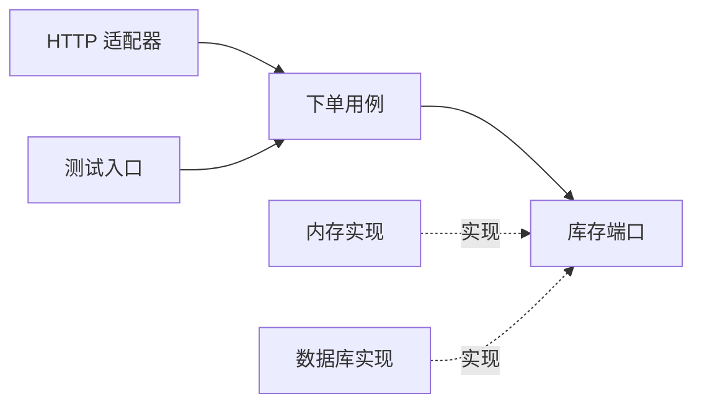

# 六边形架构、Clean Architecture 与 DDD：相近但不同的三个问题

想给下单逻辑写测试，却必须先启动数据库、消息队列和 HTTP 服务。这通常说明业务与外部技术粘得太紧。端口和适配器提供一种拆法：业务需要什么能力，就声明什么约定；具体技术在外面实现。

## 1. 端口与适配器是什么

端口是应用与外界交互的接口，不是 TCP 端口号。适配器把某种具体技术转换成这个接口的调用。HTTP Controller 和命令行入口可以驱动同一个用例；PostgreSQL Repository 和内存 Repository 可以实现同一个存储端口。

六边形只是画图方式，表达内外边界和多个交互方向，没有“必须六个接口”的要求。业务在单元测试里可以使用内存适配器，但生产数据库适配器仍需单独集成测试。



实线表示运行时协作，虚线表示实现关系。代码依赖可以由外部数据库实现指向业务定义的接口；控制流从业务调用接口，并不表示业务源码需要导入数据库驱动。

## 2. 一个可测试的业务规则

Python 3.11+ 的 `Protocol` 描述结构化接口。此处只演示端口，不把两个方法误包装成跨资源原子事务。

```python
from typing import Protocol

class StockPort(Protocol):
    def available(self, sku: str) -> int: ...

class CanQuote:
    def __init__(self, stock: StockPort):
        self.stock = stock

    def check(self, sku: str, quantity: int) -> bool:
        if type(quantity) is not int or quantity <= 0:
            raise ValueError("quantity must be a positive integer")
        return self.stock.available(sku) >= quantity

class DemoStock:
    def available(self, sku: str) -> int:
        return {"book": 5}.get(sku, 0)

assert CanQuote(DemoStock()).check("book", 3)
assert not CanQuote(DemoStock()).check("book", 6)
```

`quantity: int` 是给类型检查器的提示，不会在运行时拒绝 `1.5`。这里用 `type(quantity) is int` 明确只接受内置整数，连 Python 中属于整数子类的 `True` 也拒绝；如果领域允许特殊数字类型，需要另外规定转换规则。

这里查询得到的库存只适合报价提示，不应拿它当最终扣库存保证。实际下单仍要原子检查并扣减。把方法藏在接口后面，不会自动消除并发竞态。

## 3. Clean Architecture 关注依赖方向

Clean Architecture 同样重视业务规则与外部框架的分离。关键不是复刻一张同心圆图，而是让更稳定的业务策略少依赖更易变化的数据库、UI 和框架细节。数据跨边界时，可以用明确的请求/响应数据结构，而不是把 ORM 实体和懒加载会话到处传。

实际工程应按价值取舍。简单只读页面可能不需要完整的实体、值对象、仓储接口和用例层。如果抽象没有可测试的规则、可替换的实现或清晰的所有权，只剩层层包装，就应考虑简化。

## 4. DDD 关注业务模型

DDD 是围绕领域理解和模型建立的软件设计方法，不是与六边形架构竞争的部署风格。实体关注身份，例如订单编号；值对象关注取值与规则，例如带币种的金额；聚合围绕一组需要一起维护的业务约束确定边界，聚合根控制其合法变更。

不要把“一个数据库事务”机械等同于“一个聚合”，也不要为了有一个大事务，把所有实体纳入一个巨大聚合。先问：哪些规则必须在一次状态变化中成立？例如订单行的金额加总与订单总额需要一致，而发送邮件通常可以晚一点。

应用服务组织流程，领域对象表达规则，基础设施实现存储或网络。对于主要是数据录入与查询的简单系统，清晰的事务脚本也可能比丰富领域模型更合适。

## 练习与参考

给上面的 `StockPort` 换一个总是抛异常的实现，观察异常在哪层转换成可理解的错误。再问：哪些测试证明业务规则，哪些测试证明 SQL、序列化和连接配置？两类测试都需要。

- [Cockburn：Hexagonal Architecture](https://alistair.cockburn.us/hexagonal-architecture)
- [Robert C. Martin：The Clean Architecture](https://blog.cleancoder.com/uncle-bob/2012/08/13/the-clean-architecture.html)
- [Microsoft：领域模型设计](https://learn.microsoft.com/en-us/dotnet/architecture/microservices/microservice-ddd-cqrs-patterns/microservice-domain-model)
