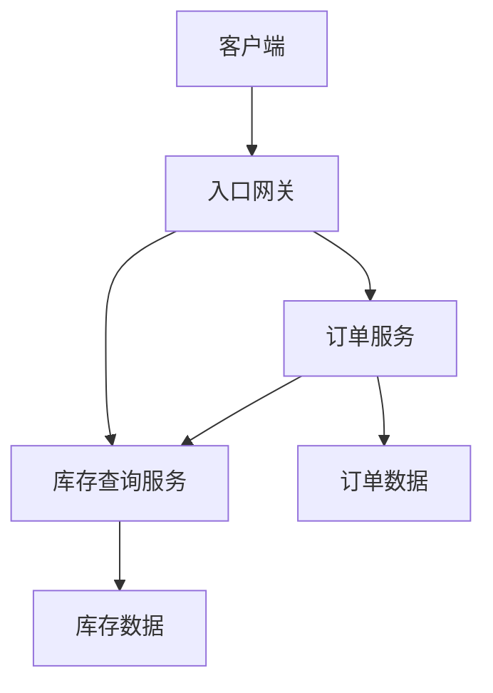

# 微服务、SOA 与服务治理：拆开以后要多承担什么

把库存从订单应用里抽出来，调用从函数变成 HTTP，代码看起来只是换了几行。但原来同进程的确定性已经变了：请求可能延迟、超时、重复，服务可能只坏一部分，发布版本也可能不同步。

## 1. 微服务的收益来自自治

微服务通常围绕业务能力划分，追求独立开发、部署和扩容。服务对自己的数据和接口承担责任。不是按代码行数评判“微”，也不是一个 CRUD 表就拆一个服务。

SOA 是更广泛的面向服务思想。微服务与它存在交集，不能简单写成“SOA 一定有 ESB、微服务一定没有”。有些 SOA 实践采用中心总线，有些系统采用轻量通信；真正要核对的是服务边界、数据所有权、治理方式和发布依赖。

## 2. 数据所有权意味着什么

订单服务可以拥有订单表，库存服务拥有库存表。订单服务需要库存能力时走 API 或事件，而不是直接更新库存私有表。否则库存的一次表结构调整仍会强制所有服务同时发布。

“每服务自己的数据库”强调自治边界，不必解释为每个服务都购买一台独立物理服务器。开发阶段可以共用基础设施、分别控制 Schema 和账号权限；但备份、迁移与故障影响仍需考虑共享资源带来的耦合。

## 3. 网关不替代业务授权

网关可处理路由、部分认证、限流和协议转换；订单服务仍负责“当前身份是否拥有这个订单”的对象级授权。服务到服务的调用也要有身份和权限，不是进了内网就都可信。

服务发现解决实例地址在哪里，负载均衡解决选哪一个，健康检查帮助判断能否接流量，超时和熔断帮助限制坏依赖的影响。它们都不自动解决业务一致性。

## 4. 防止“分布式单体”

若修改一个字段要协调八个服务同时上线，或者一次页面读取要串行经过十几个服务，独立部署的收益可能已经消失。一个调用若耗时 50ms，十层串行网络链在没有其他等待时也已有约 500ms；真实尾延迟通常更复杂。

减少聊天式 RPC：设计较完整的业务操作，批量获取需要的数据，必要时维护用途明确的读模型。对“创建订单—预留库存—支付”的跨服务流程，明确中间状态、超时查询和补偿，别试图用一个本地事务注解覆盖所有系统。

## 5. 用问题决定拆分

| 问题 | 值得拆分的证据 | 拆分前要补的能力 |
|---|---|---|
| 扩容互相拖累 | 通知或转码独占资源 | 独立队列、限额、恢复 |
| 发布互相阻塞 | 模块边界稳定且团队独立 | 契约测试、兼容策略 |
| 故障影响过大 | 允许局部降级 | 超时、隔离、业务兜底 |
| 技术需求不同 | 有测量证明不同运行时获益 | 运维、可观测性和人才成本 |

练习先从通知模块拆起，观察它停机时下单是否仍成功，消息积压怎样恢复。别直接选择最依赖本地事务的模块作为第一个迁移目标。

## 参考资料

- [Microsoft：微服务架构风格](https://learn.microsoft.com/en-us/azure/architecture/guide/architecture-styles/microservices)
- [Martin Fowler：Microservices](https://martinfowler.com/articles/microservices.html)
