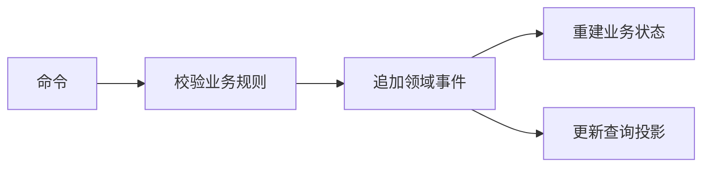

# 事件驱动、CQRS 与 Event Sourcing：别把三个概念混成一套

订单创建后，通知、搜索和统计都想知道这件事。订单接口如果逐个等待它们，任何一个变慢都会拖住用户。可以把已发生的事实发布出去，让各方按自己的节奏处理；这就是事件驱动的一种用途。

## 1. 命令是请求，事件是事实

`CreateOrder` 请求系统尝试创建订单，可以被拒绝；`OrderPlaced` 表示订单已经按约定创建。命令往往有明确处理者，事件可以有多个订阅者。名字用过去式有助理解，但最终以业务契约为准。

事件契约应包含 event ID、发生时间、来源、业务 ID 和版本。时间戳有助诊断，却不保证来自不同机器的事件全局有序；订单内部可另用递增版本表达变化顺序。

```json
{
  "eventId": "evt-demo-7",
  "type": "OrderPlaced",
  "schemaVersion": 1,
  "orderId": "order-demo-42",
  "aggregateVersion": 1,
  "occurredAt": "2026-09-22T08:00:00Z"
}
```

这里是信封示意。接收者仍需验证来源和数据范围，不按消息里自称的身份授予权限。为减少耦合，不必把整张数据库行和所有个人信息广播出去。

## 2. CQRS 分开的是职责

CQRS 将改变状态的命令模型与读取展示数据的查询模型分开。最简单形式可以在同一个进程、同一个数据库里：写入路径严格维护约束，查询路径用专门 SQL 返回页面 DTO。并不强制两套数据库，更不强制消息队列。

当搜索和统计需求变复杂，可以异步维护独立读模型。此时刚写入的数据可能暂时没有出现在列表里，要设计“处理中”、返回写入结果或按版本等待等体验。这个一致性窗口是设计的一部分，不是前端刷新几次就算解决。

## 3. Event Sourcing 改变事实来源

普通状态存储记录订单现在是什么状态。Event Sourcing 把按序保存的领域事件作为恢复业务状态的依据，通过重放得到当前结果。这与“写数据库时顺手记审计日志”不同：日志如果缺失或内容不足以重建状态，就不是这个意义上的事件源。



要防止两个写者同时基于相同旧版本追加，可以用 expected version 检查。快照用于减少重放成本，但通常不是事件序列的替代。事件格式演进、历史错误修复、隐私数据删除、投影重建和重复投递都需要专门方案。

## 4. 什么情况值得采用

普通后台 CRUD 常常只需要状态表加审计记录。复杂流程若强调历史解释、重放与多种投影，Event Sourcing 才可能抵消额外成本。即使采用 CQRS，也可以继续使用状态表。即使采用事件驱动，也可以不采用 CQRS。

原创练习：维护一份订单状态和一张订单列表投影，故意让投影处理器停机，再恢复重放。分别记录事件 ID 去重和订单版本检查如何工作。重放期间禁止再次发送真实邮件：重建视图与执行外部副作用是不同操作。

## 参考资料

- [Microsoft：CQRS](https://learn.microsoft.com/en-us/azure/architecture/patterns/cqrs)
- [Microsoft：Event Sourcing](https://learn.microsoft.com/en-us/azure/architecture/patterns/event-sourcing)
- [CloudEvents 规范](https://github.com/cloudevents/spec/blob/main/cloudevents/spec.md)
