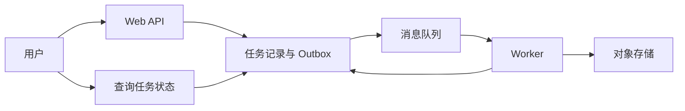

# Serverless、BFF 与 Web-Queue-Worker：按不同轴线组合架构

移动端需要精简首页，管理后台需要复杂报表，报表导出又可能花几分钟。这里同时涉及面向谁提供接口、耗时工作放哪里、程序怎样部署。BFF、Worker 和 Serverless 分别回答不同问题，可以组合使用。

## 1. BFF 是面向某类客户端的后端

Backend for Frontend 为特定客户端组织接口。例如手机首页只需订单摘要和通知数量，BFF 可以聚合这些数据，减少手机发起多次调用。它不应绕过领域服务的权限，也不宜复制支付、库存等核心规则。

不是每个前端都需要一个 BFF。客户端需求差异很小，增加中间层可能只多一次网络跳转和维护成本。GraphQL 也不是 BFF 的同义词：前者是查询 API 技术，后者是责任分工。

## 2. 长任务交给 Worker

Web-Queue-Worker 把即时请求和后台执行分开。用户提交导出，Web 层创建任务并返回任务地址；Worker 读取任务，生成文件，更新状态；用户随后查询进度或接收通知。

202 Accepted 表示已受理，并非已完成。后台任务要有 owner、状态、进度、错误、有效期和取消约定；下载文件也要验证归属。队列只保存 task ID 时，Worker 应从可信任务记录读取参数，不直接相信任意消息字段。

## 3. Serverless 并不是没有服务器

Serverless 通常把服务器分配、扩缩和一部分运维交给平台，函数式计算是常见形式之一。你仍然要管理业务状态、依赖连接、权限、成本和失败恢复。函数实例可能重用，也可能随时被回收，进程内存不适合当唯一持久化存储。

冷启动会影响某些请求延迟；执行时限、并发、请求大小和网络能力按平台及套餐不同。这里不写一组会迅速过期的万能上限，部署时用目标平台文档和负载测试记录具体值。

函数扩容也可能放大数据库连接数。把每次请求都创建连接改成受控重用或使用合适的代理，还要核对代理对事务、会话状态和连接特性的影响。

## 4. 怎样组合而不是选阵营

| 场景 | 可能的起步方案 | 先验证什么 |
|---|---|---|
| 小型管理系统 | 模块化单体 + 数据库 | 权限、备份、查询性能 |
| 文件转换/导出 | Web + Queue + Worker | 重复任务、超时、产物清理 |
| 波动明显的短请求 | 托管函数 + 持久化存储 | 冷启动、连接预算、费用 |
| 多种客户端界面 | 共用领域能力 + 必要的 BFF | 聚合延迟、契约重复 |

练习把报表导出从同步请求迁出，给任务设计 `queued/running/succeeded/failed/cancelled` 状态。Worker 崩溃后“running”怎样被判定为可重试？使用租约或心跳时，旧执行者晚到的结果又怎样被拒绝？这些比是否用了某个云名词更重要。

## 参考资料

- [Microsoft：Web-Queue-Worker](https://learn.microsoft.com/en-us/azure/architecture/guide/architecture-styles/web-queue-worker)
- [Microsoft：Backends for Frontends](https://learn.microsoft.com/en-us/azure/architecture/patterns/backends-for-frontends)
- [AWS Lambda：最佳实践](https://docs.aws.amazon.com/lambda/latest/dg/best-practices.html)
