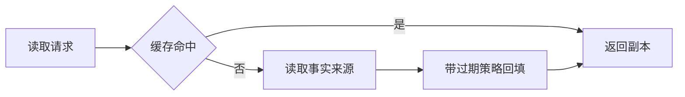

# 缓存、搜索与对象存储：每种存储各负责什么

数据库、Redis、搜索引擎和对象存储经常出现在同一张架构图上，但它们不是四个可以随意互换的“存东西的地方”。先明确数据的事实来源，再安排哪些副本服务哪些访问方式。

## 1. 把存储选择和问题对应起来

关系数据库适合需要约束、事务和关联查询的业务记录。缓存保存昂贵计算或读取的副本，用容量换响应速度。搜索引擎围绕倒排索引、分词和相关性支持检索。对象存储以对象及其键管理文件、图片和导出产物，不是可以随意原地修改文件块的本地磁盘。

订单金额通常以数据库记录为准；商品搜索结果可来自搜索索引；图片字节放在对象存储，数据库保存归属、对象键与元数据。某个对象键存在，不代表当前用户有权下载。

## 2. Cache-aside 的正常路径和竞态

Cache-aside 是应用先查缓存，未命中再查数据库并回填。写入常先提交数据库，再删除对应缓存。这个常用方案仍有竞态：读者拿到旧数据库值，写者提交并删缓存，读者随后把旧值填回。

要根据业务容忍窗口选择短 TTL、版本化缓存、事件失效与重试等策略。库存扣减、余额校验不应只相信一个可能过期的缓存值。提高命中率不是唯一目标，旧数据的业务后果更重要。

## 3. 三种常见压力模式

不存在的键被反复查询，可通过输入校验、适当的短期空值缓存或布隆过滤器降低回源；布隆过滤器可能假阳性，而且数据更新要维护它。一个热门键过期导致大量同时回源，可以用请求合并和有限并发。大批键同一时刻过期，则可以分散过期时间、做容量预案。

所谓穿透、击穿、雪崩是帮助讨论的名字，先观察实际流量模式，再选方案。锁也不是万能：基于租期的锁可能过期，旧持有者仍继续执行，关键资源要靠自身约束或版本令牌阻止陈旧写入。

## 4. HTTP 缓存与业务缓存

HTTP 缓存依据响应头和协议规则工作，与应用里的 Redis 缓存不同。`no-store` 表示不要保存；`no-cache` 允许保存但复用前需要验证。`private` 限制共享缓存，而不是加密响应。

用户私有页面、权限相关 API 要格外明确缓存键和共享范围。不同租户或身份的结果混用，比缓存稍慢严重得多。ETag 与条件请求可减少重复传输，但要保证验证器反映实际表示变化。

## 5. 文件和搜索索引的恢复

上传先生成受控对象键，限制大小、类型和访问范围，必要时完成内容检查再允许公开访问。临时上传和失败任务需要生命周期清理。下载链接即使带签名，也要控制有效期和可转发风险。

搜索索引更新可通过 Outbox 或 CDC 驱动，但仍要监控延迟和失败。重建索引时记录数据范围与版本，检查数量和抽样内容，再切换读取别名或路由。别直接删掉唯一可用的索引再希望重建能及时完成。

## 自检与参考

给每种数据标注事实来源、可接受陈旧时间、备份方式与重建步骤。假设 Redis 丢失全部缓存，系统会变慢还是丢业务记录？如果答案是后者，就应重新确认它实际上承担的角色。

- [RFC 9111：HTTP Caching](https://datatracker.ietf.org/doc/html/rfc9111)
- [Redis：分布式锁与限制](https://redis.io/docs/latest/develop/clients/patterns/distributed-locks/)
- [Elasticsearch：近实时搜索](https://www.elastic.co/docs/manage-data/data-store/near-real-time-search)
- [Amazon S3：对象与存储模型](https://docs.aws.amazon.com/AmazonS3/latest/userguide/Welcome.html)
