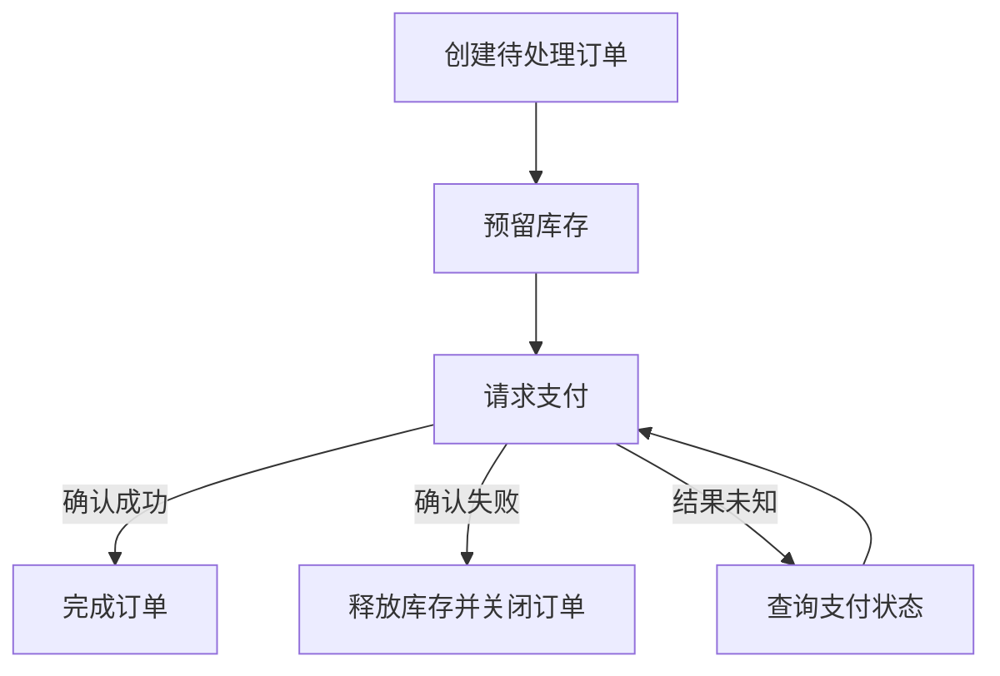

# 一致性、CAP 与 Saga：跨服务流程怎样收尾

订单服务说支付成功，库存服务却还在处理预留。用户应该看到“完成”“处理中”还是“失败”？分布式一致性讨论最终要回到这些具体可观察的行为，而不是只给数据库贴 CP 或 AP 标签。

## 1. 同一个词可能表达不同约束

强一致、线性一致、可串行化、最终一致不是随意互换的词。线性一致关注操作仿佛在调用与返回之间某一点原子发生并符合实时顺序；可串行化关注并发事务的效果可解释为某个串行顺序。它们讨论的对象与要求不同。

最终一致通常描述在没有新更新并满足系统前提时副本最终收敛，并未给出固定收敛秒数。业务还要定义冲突解决、读己之写、单调读取以及用户看到中间状态的规则。

## 2. CAP 是特定故障模型下的限制

网络分区发生时，不同节点之间暂时失去通信。CAP 讨论此时线性一致性与其特定定义的可用性难以同时满足；这里的可用性不是运维报表上的 99.9%。日常没有分区时，系统仍需权衡延迟、成本与一致性，但那不是简单的“CAP 三选二”。

同一个产品对不同操作、配置和故障模式可能提供不同保证。选型时问“这个写入请求在多数副本不可达时怎样响应”，比问“这个品牌永远是 CP 吗”更准确。

## 3. Saga 是一组可恢复的本地步骤

当跨系统的大事务不合适时，可以把流程拆成本地事务，并在后续失败时执行补偿。下单的一个例子是创建待处理订单、预留库存、请求支付，全部完成后标记成功。

图中“结果未知”非常重要：支付接口超时不证明扣款没发生。应查询同一个业务请求的状态，再决定重试或补偿，而不是立刻换新请求号再次支付。实际流程还要限制查询次数、设最终人工处理路径，图中循环不是无限重试的实现要求。

## 4. 补偿不是时间倒流

退款是新的业务操作，不等于原付款从未存在。已经发出的邮件更不可能通过数据库回滚让用户没看过。补偿可能失败、可能需要重试，也可能只部分恢复，所以要保存流程状态、步骤 ID、错误和负责人。

编排方式由一个协调者决定下一步；协同方式由参与者通过事件响应。编排更容易集中观察流程，协同减少中心流程耦合但容易出现难以追踪的事件链。选择取决于流程复杂度与团队边界，不是某一种天然更先进。

## 5. 并发时仍要保护业务约束

Saga 不自动提供跨步骤隔离。库存预留应拥有明确状态和到期策略；退款、取消、发货可能同时发生，需要合法状态转换检查和幂等操作。若某个业务要求极强的跨实体不变量，应重新考虑是否拆开数据边界，或是否有适合的事务协议，而不是强行套 Saga。

## 练习与参考

列出下单的每一步及其“成功、失败、未知”结果，写明可查询接口和补偿动作。最后加入“补偿也超时”，观察流程是否还有可恢复的状态。

- [Gilbert 与 Lynch：CAP 论文](https://users.ece.cmu.edu/~adrian/731-sp04/readings/GL-cap.pdf)
- [AWS：Saga Orchestration](https://docs.aws.amazon.com/prescriptive-guidance/latest/cloud-design-patterns/saga-orchestration.html)
- [PostgreSQL：Serializable 隔离](https://www.postgresql.org/docs/18/transaction-iso.html)
