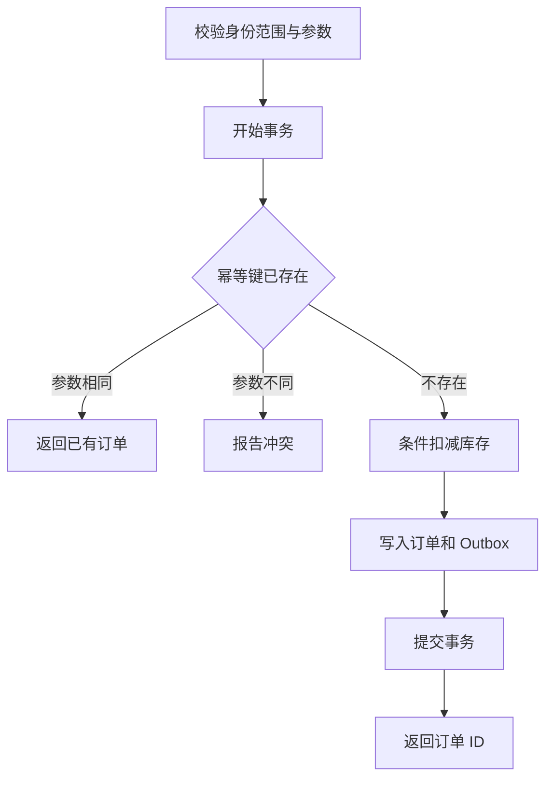

# 订单服务实战：用库存、幂等和 Outbox 串起后端知识

这一篇把前面的概念落到一个小项目：只卖一种商品、用一种货币、一次订单一种 SKU。限制需求不是偷懒，而是让库存、重复请求和事务恢复的关系可以被清楚验证。之后再逐步增加功能。

## 1. 本机环境与运行

仓库包含标准库实现 `examples/backend/order_service.py` 和测试 `tests/backend/test_order_service.py`。可在 [GitHub 查看示例源码](https://github.com/jame100101/Personal-knowledge-base/blob/main/examples/backend/order_service.py) 和 [对应测试](https://github.com/jame100101/Personal-knowledge-base/blob/main/tests/backend/test_order_service.py)。需要 Python 3.11+，不额外安装依赖。Windows 可使用 `py` 或已安装的 `python` 命令。

```bash
python examples/backend/order_service.py
python -m unittest discover -s tests/backend -v
```

程序使用本地临时 SQLite 数据库展示下单与重试，运行结束清理临时文件，不连接网站的 Supabase。它是业务核心教学，不包含 HTTP 身份认证、真实支付、消息 Broker 或线上运行配置。SQLite 的写锁行为不代表 PostgreSQL；迁移数据库后仍需重新测试事务和并发。

## 2. 四张表的职责

| 表 | 保存什么 | 关键约束 |
|---|---|---|
| stock | 商品的可售数量 | SKU 主键、数量非负 |
| orders | 已创建订单及请求身份 | 用户与幂等键唯一、数量为正 |
| outbox | 待发布的订单事件 | event ID 唯一、关联订单 |
| delivered | 模拟消费者已处理的事件 | event ID 唯一 |

演示的消费者只把事件记入 `delivered`，不真的发邮件。去重记录和发送完成状态在一个数据库事务更新，是为了测试本地约束；真实 Broker 发布与第三方邮件服务需要各自的确认与幂等协议。

## 3. 下单的完整顺序



实际认证应在 HTTP 入口完成；教学核心接收的 `user_id` 假设已经由可信调用者确定。复用 key 时比较 SKU 和数量，防止把不同请求静默合并。条件扣减失败就回滚；订单或 Outbox 插入失败也一起回滚。

库存更新使用数据库条件而不是“读出来减一再保存”。用例返回后客户端是否收到响应，是另一个问题：若网络丢失，客户端沿用原 key 查询或重试即可得到相同订单，而不再扣库存。

## 4. 每个测试要证明什么

- 正常下单：库存减少、订单与待发事件同时出现。
- 同请求重试：返回相同订单，库存只减少一次。
- 同 key 改参数：明确冲突，不静默复用。
- 库存不足：不存在半个订单或多余 Outbox。
- 故障注入：扣库存后主动触发异常，库存仍能恢复。
- 竞争同一库存：多个线程使用独立连接，成功订单数不超过库存。
- 消费重复事件：演示消费者只保存一次业务记录。

这些测试证明这个教学实现的约束，不是外推为所有数据库、所有分布式故障都被覆盖。测试名称和断言应能对应到一个清楚的业务承诺。

## 5. 怎样扩展成 Web 服务

先加 HTTP 路由与认证，映射错误、限制请求体和数量；再接 PostgreSQL，使用迁移文件创建表，在两个数据库连接上重复并发测试。随后拆出 outbox relay，接一个实际 Broker，并故意在发送和标记之间崩溃。

最后增加指标、日志和部署配置。用真实接口验证权限归属与幂等，给迁移写回滚或向前修复步骤。不要为了“像真实项目”一开始就加入注册中心、服务网格和十种中间件；每个组件都应对应一个已经测到的需求。

## 参考资料

- [Python sqlite3：事务控制](https://docs.python.org/3/library/sqlite3.html#transaction-control)
- [SQLite：事务](https://www.sqlite.org/lang_transaction.html)
- [AWS：Transactional Outbox](https://docs.aws.amazon.com/prescriptive-guidance/latest/cloud-design-patterns/transactional-outbox.html)
