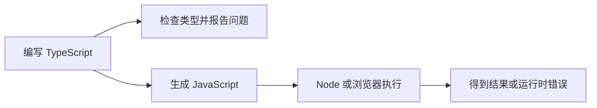

# TypeScript 运行模型、类型擦除与编译产物

上一章里，我们写的是 `.ts`，最后交给 Node 的却是 `.js`。那中间到底少了什么？

先记住一个实际后果：**给数据写上类型，不代表程序运行时会替你检查数据。** 比如接口声明说用户编号是字符串，服务器照样可能发来一个数字。要理解为什么，最好亲自看一次编译结果。

## 1. 打开生成的 JavaScript 看一眼

下面是一段完整的小程序：

```typescript
type User = { name: string }

function greet(user: User): string {
  return `Hello, ${user.name}!`
}

console.log(greet({ name: "Ada" }))
```

编译之后，核心代码会变成这样。具体分号、模块标记和源码映射注释取决于配置，先只看函数本身：

```javascript
function greet(user) {
  return `Hello, ${user.name}!`
}

console.log(greet({ name: "Ada" }))
```

`type User` 消失了，参数和返回值后面的类型也消失了。留下的代码负责真正的计算、打印和其他操作。把这些只给编译器看的类型语法去掉，通常就叫**类型擦除**。

可以把整条过程理解为两件相互关联、但用途不同的事：一边检查代码写得是否符合类型约定，一边准备运行所需的 JavaScript。



图里特意没有写成“类型检查通过，所以程序一定正确”。例如把加法写成减法，两边都是数字，类型检查通常不会知道你原本想算什么。

## 2. 报了类型错误，为什么还会生成文件

如果没有打开 `noEmitOnError`，`tsc` 在报告类型错误后仍可能生成 JavaScript。这是编译器允许的一种行为，不是“错误自动修好了”。

下面三个名字很像，作用却不同：

| 操作或配置 | 实际做什么 |
| --- | --- |
| `tsc --noEmit` | 检查项目，不输出 JavaScript |
| `tsc` | 按配置检查并生成文件；出错时是否继续输出取决于配置 |
| `noEmitOnError: true` | 本次有错误时不写新的输出文件，不负责删除之前的旧产物 |

所以构建脚本应该在前一步失败时停下来。上一章让你逐条执行命令，是为了看清每一步；自动化脚本则应检查退出码，而不是不管结果如何都继续启动旧文件。

## 3. 为什么类可以用 `instanceof`，接口却不行

看这段代码：

```typescript
interface User {
  id: string
}

class Session {
  constructor(readonly user: User) {}
}

const session = new Session({ id: "u-1" })
console.log(session instanceof Session) // true
```

`User` 只描述“这个对象应该有哪些字段”。它被擦除后，运行中的程序没有一个叫 `User` 的构造函数，因此 `instanceof User` 没有可供检查的对象。

`Session` 不一样。类除了提供类型，还对应一个真实的 JavaScript 构造函数。`new Session(...)` 创建实例，`instanceof Session` 根据原型链检查实例关系；它不是逐个检查对象字段的工具。

教程里常说的两个词，其实就在描述这件事：

- **类型空间**：写类型时使用的名字，例如这里的 `User`。
- **值空间**：程序执行时真实存在的名字，例如 `session` 和构造函数 `Session`。

同一个类名可以出现在两边。理解这一点，再看 `import type` 就顺了：它是在明确告诉工具，这个导入只用于类型检查，不需要成为运行时导入。

假设 `user.ts` 导出了 `User` 类型，在另一份 Node ESM 源文件里可以这样导入：

```typescript
import type { User } from "./user.js"

export function userId(user: User): string {
  return user.id
}
```

这里写 `.js` 是因为沿用的是上一章的 Node ESM 编译方案，运行时加载生成的 `.js`。不要仅凭源码后缀是 `.ts` 就把所有导入都改成 `.ts`；直接执行源码和先编译再执行，是两种不同配置。

## 4. `as` 是告诉编译器，不是改变数据

假设拿到的 JSON 是这样：

```typescript
const payload: unknown = JSON.parse('{"id":123}')
const user = payload as { id: string }

console.log(typeof user.id) // "number"
```

`as { id: string }` 并没有把 `123` 变成 `"123"`。它只是让编译器按你指定的类型继续检查。此时如果接着调用 `user.id.toUpperCase()`，编辑器可能不报类型错误，运行时却会报错，因为数字没有这个方法。

这里有三种不同的意图，代码也应该分别表达：

- **确认数据符合要求**：检查字段和类型，不符合就报告错误。
- **把数据转换成另一种形式**：显式调用转换代码，例如对一个已知数字使用 `String(...)`。
- **告诉编译器你知道更多信息**：使用类型断言，但数据本身保持原样。

把它们混起来，就容易把“编译通过”误当成“数据正确”。

## 5. 真正检查一份外部数据

沿用用户编号必须是字符串的要求，可以写一个小解析函数：

```typescript
type User = { id: string }

function parseUser(input: unknown): User {
  if (typeof input !== "object" || input === null) {
    throw new TypeError("用户数据应该是一个对象")
  }
  if (!("id" in input) || typeof input.id !== "string") {
    throw new TypeError("用户编号 id 应该是字符串")
  }
  return { id: input.id }
}

console.log(parseUser({ id: "u-1" })) // { id: "u-1" }
// parseUser({ id: 123 }) // 会抛出 TypeError
```

逐句看比背函数更有用：

1. 先排除数字、字符串等值，还要单独排除 `null`，因为 JavaScript 的 `typeof null` 是 `"object"`。
2. 再确认 `id` 存在，而且它当前的值是字符串。
3. 最后组装并返回符合 `User` 要求的对象。这一步也没有把不相关的字段原样带出去。

这些 `if` 会留在 JavaScript 中，因此程序每次执行到这里都会检查数据。这才是**运行时验证**。这个例子只验证字段类型，没有检查空字符串、编号格式，也没有要求字段必须是自有属性；真实业务需要哪些条件，就继续加哪些条件，而不是以为一个 `User` 名字已经替你规定好了一切。

## 6. 并非所有 TypeScript 语法都会直接消失

“类型会擦除”不等于“删掉冒号后面的内容就能编译全部 TypeScript”。有些语法会生成额外代码：

| 写法 | 编译后通常会发生什么 |
| --- | --- |
| 类型标注、`interface`、`type`、`as` | 纯类型部分被擦除 |
| `class` | 保留为类，或按目标版本转换；类本身是运行时的值 |
| 普通 `enum` | 通常生成一个 JavaScript 对象 |
| 带运行时内容的 `namespace` | 可生成用于封装成员的对象和函数调用 |
| 构造函数参数属性，例如 `constructor(public name: string)` | 生成对应的属性初始化代码 |
| 装饰器 | 按装饰器方案和配置生成相应的调用代码 |
| `const enum` | 可以内联成员值，是否保留声明还受配置和工具影响 |

这也解释了为什么某个工具能直接运行一部分 `.ts` 文件，遇到另一种语法却报错：有的工具只剥离类型，不负责完整的语法转换。是否支持某个特性，要看实际运行器和版本；不要用“支持 TypeScript”这句话推断它支持所有语法，也不要把它等同于做过完整类型检查。

## 7. 编译器认识某个 API，不代表环境里有它

配置中的 `target`、`lib` 经常一起出现，但它们不负责同一件事。

`target` 主要决定输出代码的语法级别，例如是否要转换某些较新的 JavaScript 写法。`lib` 则决定编译器可以查阅哪些标准 API 的类型声明。例如：

```json
{
  "compilerOptions": {
    "target": "ES2022",
    "lib": ["ES2022", "DOM"]
  }
}
```

这份配置让编译器认识 `document` 等 DOM 名字。可是把使用 `document` 的程序放进没有 DOM 的 Node 环境，运行时仍然会出错。**类型声明描述 API，不安装 API。**

同样，把 `target` 调低也不会自动为旧环境补上 `Promise`、`fetch` 或新数组方法。需要额外兼容实现时，要选择适合的 polyfill 或调整代码。反过来，Node 可能提供 `fetch`，也不等于它就提供完整浏览器 DOM。

## 8. 用三个问题检查自己的理解

沿用上一章的项目，分别运行类型检查、构建和程序：

```bash
npm run typecheck
npm run build
npm start
```

然后打开输出文件，回答：

- 报错来自编译器，还是程序真正执行以后？
- 自己写的哪几行被擦除了，哪几行还会运行？
- 如果输入来自网络，而不是源码里的对象，现在哪段代码负责检查它？

你可以把 `parseUser` 放进项目，分别传入 `null`、`{}`、`{ id: 123 }`、`{ id: "u-1" }`。每次单独运行一个输入，先猜结果再验证。这样比记一句“TypeScript 是静态类型语言”更容易真正理解它管到哪里。

进一步查阅：[The Basics](https://www.typescriptlang.org/docs/handbook/2/basic-types.html)、[类型声明的作用](https://www.typescriptlang.org/docs/handbook/2/type-declarations.html)、[`noEmitOnError`](https://www.typescriptlang.org/tsconfig/noEmitOnError.html)。
