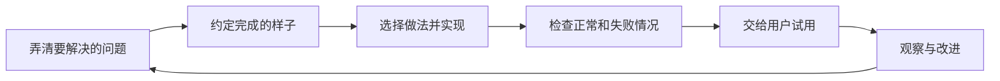

# 软件工程到底在解决什么：从一个收藏按钮开始

你已经会写一点代码，给文章加一个“收藏”按钮并不难。点一下，星星亮起来，看上去就完成了。第二天换台电脑，收藏没了；朋友登录，又看到了你的收藏。按钮确实能点，可这个功能还不能放心交给别人使用。软件工程要处理的，就是从“代码跑起来”到“人能长期用下去”之间的这些事情。

## 1. 先看看使用者究竟要什么

假设小林用知识库准备考试。他不是想欣赏一颗会变色的星星，而是想明天继续读今天没看完的文章。于是我们先记下一句话：“小林登录以后，可以保存一篇文章，换设备后还能找到。”这句话决定了数据不能只放在当前页面的变量里，也决定了收藏必须属于某个用户。

再问两件小事：文章被删除后怎么办？保存失败时是否仍显示已收藏？这些问题不需要先懂复杂技术就能讨论。越早问清楚，越少出现“代码写完才发现理解错了”。把要解决的问题、使用场景和限制说清楚，叫做需求工作。

## 2. 把一次改动走完整

我们可以用一张纸记下这次工作的顺序：

每一步都有可以看到的结果。需求阶段留下几条例子；设计阶段说明数据放哪里、谁能访问；实现阶段留下代码；检查阶段留下测试结果；发布后观察是否真的有人成功找回文章。这里的“设计”不一定是几十页文档，一段说明加一张图也可以。

这张图不是规定所有工作只能顺序做一次。试用可能发现“收藏太多找不到”，我们会回到需求讨论。工程方法的价值是让反馈有地方落下，而不是假装第一次就能猜对所有事情。

## 3. 为什么一个人也需要这些步骤

一个人写的小工具，同样会被未来的自己维护。三个月后，你可能忘记为什么收藏按文章 ID 保存，而不是按标题保存。标题会改，稳定的 ID 才能继续指向同一篇文章。如果当时留下一句理由，后来就不容易把正确设计“优化”掉。

不过，工程工作要与风险相称。一次性的私人计算脚本，不必照搬多人团队的审批流程；保存他人数据的网站，就不能因为开发者只有一个人而省掉权限检查和备份。人数影响沟通方式，数据和失败后果决定需要多认真地验证。

## 4. 能用、好改和成本要一起考虑

假设两种做法都能完成收藏。甲需要一个小表和几个接口；乙需要三种新服务和一个消息队列。如果目前只有几十个用户，乙带来的运维工作可能超过收益。但甲若把用户身份完全忽略，再省事也不合格。

可以把选择写成三个问题：是否满足明确的需求？常见变化是否容易处理？建设和维护的成本是否承担得起？软件工程很少有脱离条件的“最佳架构”。合理的答案总要说明用户、规模、风险和团队能力。

代码行数也不适合单独衡量进展。删掉重复逻辑可能让项目更好，却让行数下降；写出一千行不能证明用户的问题已经解决。更直接的证据是：小林能否在另一台设备上找到刚保存的文章。

## 5. 现在就做一张功能卡

不用打开编辑器，先写下：使用者是谁、他遇到什么困难、第一版做什么、暂时不做什么、怎样证明做成了。例如第一版支持收藏和取消收藏，暂不支持文件夹整理；用两个账号验证互相看不到对方收藏，用刷新验证数据保留。

之后每学一章，就给这张卡补一点信息。你会得到一条从问题到验证的记录，而不是散落的术语笔记。

## 练习与参考答案

“按钮点击后变黄”能否证明收藏功能完成？不能。它只证明一种界面反馈，还需要验证保存结果、重新加载、用户隔离和失败提示。第一版可以范围很小，但承诺的行为应走通。

## 阅读依据

- [Software Engineering at Google：什么是软件工程](https://abseil.io/resources/swe-book/html/ch01.html)
- [Software Carpentry：版本控制入门](https://swcarpentry.github.io/git-novice/)
