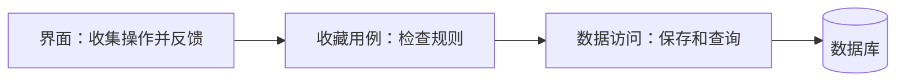

# 模块边界与接口约定：让改动有一个落脚点

收藏功能刚开始只有二十行，后来增加登录判断、网络请求、错误提示、列表排序，一次按钮点击变成两百行。改提示文字都担心碰坏保存逻辑。此时需要的不是立即换框架，而是把不同职责分开，让每一处代码有明确的工作。

## 1. 顺着一次操作找职责

用户点击收藏后，页面先收集操作；服务端确认身份和文章权限；业务逻辑决定是否允许保存；数据库持久化结果；页面根据结果更新提示。这是几个不同问题，不应因为从同一个按钮开始就全部挤进一个函数。

可以先分成界面、收藏规则、数据访问三部分。界面知道“怎样显示”，规则知道“什么算合法”，数据访问知道“怎样读写存储”。这是一种教学用分法，并不是任何项目都只能三层。



箭头表示调用关系，不表示身份检查只能存在于某一个框里。服务端必须执行实际授权，不能把页面隐藏按钮当成保护措施。

## 2. “高内聚、低耦合”先翻译成人话

经常一起变化的东西放近一点，不相关的东西少互相知道细节。收藏规则放在一起，改“最多保存多少篇”时能找到一个清楚的位置，这就是内聚。页面无需知道具体 SQL，换存储实现时尽量不改页面，这有助于降低耦合。

低耦合不是完全没有依赖。页面仍需知道保存会成功还是失败。我们要减少的是对内部细节的依赖，例如直接读取另一个模块的私有变量，而不是禁止模块之间合作。

## 3. 接口是合作约定，不只是一个 URL

先用自然语言写清楚：输入是一篇文章的稳定 ID，身份来自服务端已验证的登录信息；成功后表示该用户已保存这篇文章；相同操作重复执行仍只有一条；无权限时拒绝。

一个示意接口可以是 `PUT /me/favorites/article-42`，表示把当前用户对 article-42 的收藏设置为存在。取消可用 `DELETE`。这是练习设计，不是本知识库已经提供的 API。具体项目可以采用其他路径，但要统一说明状态码、错误格式和重试行为。

不要把“切换收藏”当成网络重试安全的默认选择。切换执行两次会回到原状态；“设置为已收藏”更容易保持重复请求效果一致。即便接口方法合适，服务端也仍需实现相应行为。

## 4. 用数据约束守住规则

如果两个请求同时检查“还没收藏”，它们都可能随后写入。先查再写并不能独自阻止重复。持久化设计应给用户 ID 与文章 ID 的组合加唯一约束，并约定遇到重复时如何返回已有结果。

```text
收藏记录：user_id、article_id、created_at
唯一规则：同一组 user_id + article_id 只能出现一次
查询范围：只返回当前已验证用户能够访问的记录
```

这只是数据模型草图。真实数据库还需要字段类型、外键、权限策略和迁移步骤。先理解规则，再去学习对应 SQL，会比一次复制整套建表语句更容易发现遗漏。

## 5. 不要为假想变化设计十层抽象

如果只有一种实现、没有替换需求，一个清楚的小函数往往够用。只有当变化或测试真的受阻时，再提取稳定接口。给每个函数配一个工厂和抽象类，可能只是把理解成本搬到更多文件。

评估拆分的办法是提一个真实变化：“以后收藏上限从 100 改成按套餐配置，要改哪里？”如果规则散在五个页面，就需要收拢；如果只在一个清楚的地方，暂时未必需要更复杂的结构。

## 练习与参考答案

把“显示红色错误文字”“检查文章是否允许收藏”“写入数据库”分别放哪里？前者属于界面；第二项属于服务端的规则与授权处理；第三项属于数据访问。返回给界面的应是稳定结果或错误类别，不能让页面通过猜测数据库错误文本来决定业务行为。

## 阅读依据

- [C4 model：用不同层次表达系统](https://c4model.com/)
- [RFC 9110：安全与幂等方法](https://www.rfc-editor.org/rfc/rfc9110.html)
- [PostgreSQL：唯一约束与外键](https://www.postgresql.org/docs/17/ddl-constraints.html)
