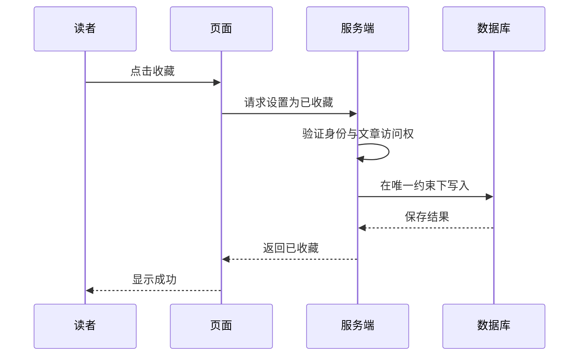

# 设计图、取舍与决策记录：让别人知道你为什么这样做

你把收藏保存到服务器，同事却问：“浏览器也能存，为什么不直接用本地存储？”如果回答只有“这样比较专业”，讨论很难继续。设计除了决定做法，还要把做法与需求连起来，让后来接手的人能重新判断。

## 1. 先画谁和谁发生联系

第一张图只画读者、知识库、登录服务和数据库，不急着展开函数。它回答系统为谁服务，以及依赖哪些外部东西。画清系统边界后，再选一个局部展开，例如收藏接口如何访问数据库。

C4 用系统上下文、容器、组件和代码几个层次逐步放大。这里的容器是可运行应用或数据存储等边界，不等于 Docker 容器。小项目不必画齐所有层次；只画能回答当前问题的图。

图里每条线写上动词，如“提交收藏请求”“读取当前用户的记录”。只写“A 连着 B”会遗漏方向、目的和数据内容。还应标出哪些部分在浏览器、哪些在服务端，避免把用户可修改的页面状态误认为可信数据。

## 2. 描述顺序时换一种图

结构图适合回答“有哪些部分”，不擅长表达“保存失败后怎样”。可以使用顺序图，把一次操作按时间展开：



这张图只画成功路径。再问数据库不可用、身份过期、响应丢失时各停在哪一步，补一张失败流程或一段文字。图不需要很漂亮，但不能把关键失败情况藏掉。

## 3. 对比方案时先写约束

本例的约束是跨设备找回、私人收藏和已有登录系统。浏览器本地存储便于做原型，但本身不提供跨设备同步；服务端保存增加接口和存储成本，却更贴合当前目标。

| 方案           | 适合的场景       | 本例需要承担的代价       |
| -------------- | ---------------- | ------------------------ |
| 当前页面变量   | 演示交互         | 刷新即丢失               |
| 浏览器本地存储 | 单设备离线小工具 | 需另做账号隔离与同步     |
| 服务端持久化   | 登录后跨设备使用 | 需要权限、接口和运行维护 |

不要把表格写成一个方案全是优点、另一个全是缺点。设计是针对条件选择；条件变化时，结论也可能变化。例如离线优先产品就需要额外考虑本地副本与同步冲突。

## 4. 用一页纸记住关键决定

这种记录通常叫 ADR，即架构决策记录。一个简单版本如下：

```text
题目：私人收藏保存在哪里
状态：已采用
背景：需要跨设备访问，网站已有登录和数据库
选择：在服务端按用户保存，使用稳定文章 ID
备选：仅放在浏览器；无法独立满足跨设备需求
后果：需要授权检查、唯一约束和失败提示
重新讨论的条件：明确要求离线编辑并跨设备合并
```

“后果”不只是优点，也包括维护成本和限制。将来要改变决定，可以新增替代记录并链接旧记录，保留当时上下文。否则删掉历史理由后，团队可能反复争论同一个问题。

## 5. 图和文档应该随着什么更新

只改按钮颜色，通常不需要改系统图；新增第三方登录服务，就应更新外部依赖说明。把需要更新文档的判断放进评审，避免文档与实际系统长期分离。

同样，不必为每个变量命名都写 ADR。记录影响范围大、不容易撤回、以后容易争论的决定即可。文档量不是目标，读者能否找到重要理由才是目标。

## 练习与参考答案

有人提议把收藏拆成独立服务，你至少需要哪些信息？当前访问量、团队边界、独立发布需求、故障隔离收益，以及额外部署和调用成本。如果没有这些证据，“微服务更先进”不能独自支持拆分。先保留模块边界，再根据实际需要决定是否独立部署。

## 阅读依据

- [C4 model：官方介绍](https://c4model.com/)
- [ADR 社区：决策记录与模板](https://adr.github.io/)
