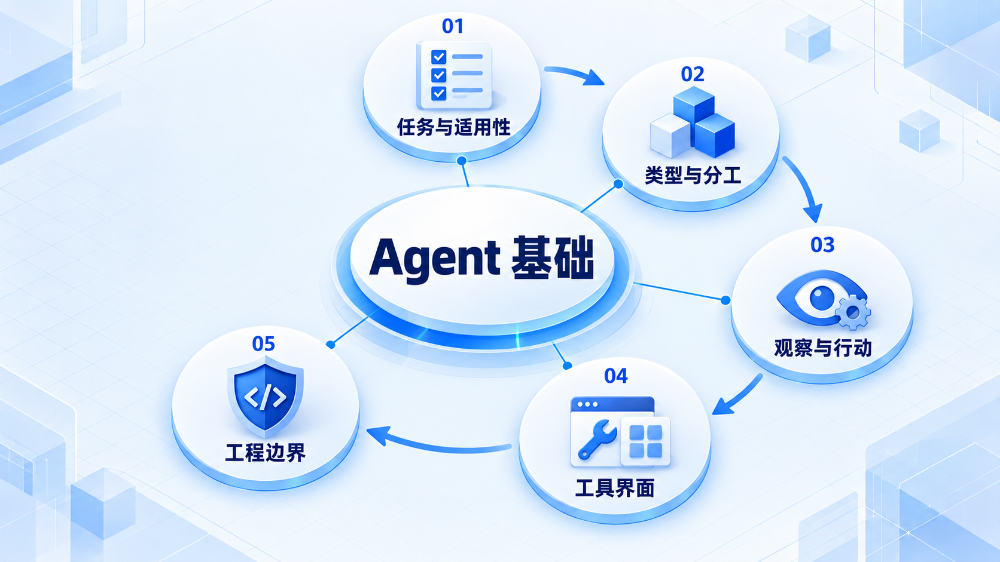
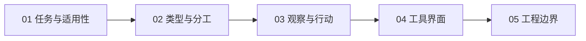

# Agent 基础

先判断任务是否需要 Agent，再区分聊天、工作流和自主循环；用一个小循环理解工具界面与工程边界。

## 学习路线

箭头表示本章概念的推荐学习顺序，不表示实际系统只允许单向运行。框架与方案对照中的选项可以按项目需要选择。

## 本章核心模块

1. **任务与适用性**
2. **类型与分工**
3. **观察与行动**
4. **工具界面**
5. **工程边界**

## 按课程顺序阅读

1. [Agent 适用范围：什么时候使用，什么时候优先 Workflow](<../../content/Agent开发/01-Agent基础/03-Agent适用范围.md>) · 文章
2. [Agent 类型区分：Chatbot、Workflow、Agent 与 Multi-Agent](<../../content/Agent开发/01-Agent基础/01-Agent类型区分.md>) · 文章
3. [Agent 基本循环：Observe → Think → Act → Observe](<../../content/Agent开发/01-Agent基础/02-Agent基本循环.md>) · 文章
4. [SWE Agent 基础概念与 ACI](<../../content/Agent开发/01-Agent基础/04-SWE Agent基础概念与ACI.md>) · 文章
5. [Agent 统一工程模型与概念边界](<../../content/Agent开发/01-Agent基础/05-统一工程模型与概念边界.md>) · 文章
6. [Agent 基础推荐阅读](<../../content/Agent开发/01-Agent基础/000-Agent基础推荐阅读.md>) · 文章

[返回全部章节](README.md)
