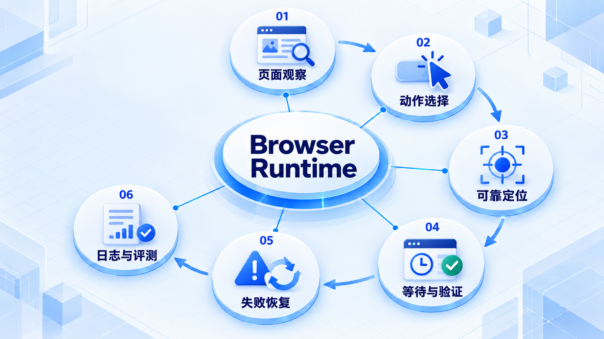

# Browser Runtime

先观察当前页面，再选择可验证的动作；用稳定定位、等待条件和失败恢复组织循环，并保留评测证据。

## 学习路线

箭头表示本章概念的推荐学习顺序，不表示实际系统只允许单向运行。框架与方案对照中的选项可以按项目需要选择。

## 本章核心模块

1. **页面观察**
2. **动作选择**
3. **可靠定位**
4. **等待与验证**
5. **失败恢复**
6. **日志与评测**

## 按课程顺序阅读

1. [Browser Agent 的观察—动作循环](<../../content/Agent开发/04-Tools与Runtime/02-Browser Runtime/01-Browser Agent观察动作循环.md>) · 文章
2. [Playwright 可靠操作与失败恢复](<../../content/Agent开发/04-Tools与Runtime/02-Browser Runtime/02-Playwright可靠操作与失败恢复.md>) · 文章
3. [截图、DOM、动作日志与 Browser Agent 评测](<../../content/Agent开发/04-Tools与Runtime/02-Browser Runtime/03-截图DOM动作日志与评测.md>) · 文章
4. [Browser Agent 推荐阅读](<../../content/Agent开发/04-Tools与Runtime/02-Browser Runtime/000-Browser Agent推荐阅读.md>) · 文章

[返回全部章节](README.md)
