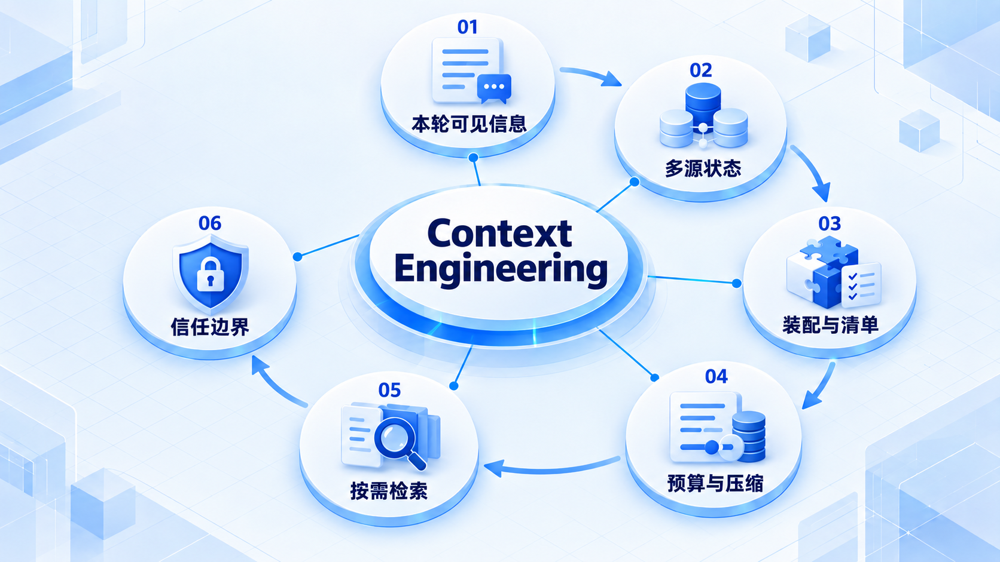

# Context Engineering

先看模型本轮实际收到什么，再按任务装配上下文；预算、检索与压缩都不能混淆可信指令和不可信材料。

## 学习路线

箭头表示本章概念的推荐学习顺序，不表示实际系统只允许单向运行。框架与方案对照中的选项可以按项目需要选择。

## 本章核心模块

1. **本轮可见信息**
2. **多源状态**
3. **装配与清单**
4. **预算与压缩**
5. **按需检索**
6. **信任边界**

## 按课程顺序阅读

1. [Context Engineering 总览](<../../content/Agent开发/03-Context Engineering/01-Context Engineering总览.md>) · 文章
2. [Context：模型本轮真正看到的信息](<../../content/Agent开发/03-Context Engineering/02-Context上下文.md>) · 文章
3. [Input Context Builder：把多源状态装配成一次模型请求](<../../content/Agent开发/03-Context Engineering/03-Context Builder与Prompt Assembly.md>) · 文章
4. [Context Manifest 与 Context Assembly](<../../content/Agent开发/03-Context Engineering/04-Context Manifest与Assembly.md>) · 文章
5. [Token Budget、Compaction、Prompt Cache 与 History](<../../content/Agent开发/03-Context Engineering/05-Token Budget Compaction Prompt Cache与History.md>) · 文章
6. [JIT Retrieval 与 Progressive Disclosure](<../../content/Agent开发/03-Context Engineering/06-JIT Retrieval与Progressive Disclosure.md>) · 文章
7. [Context Trust Boundary 与 Prompt Injection Boundary](<../../content/Agent开发/03-Context Engineering/07-Context Trust与Prompt Injection边界.md>) · 文章

[返回全部章节](README.md)
