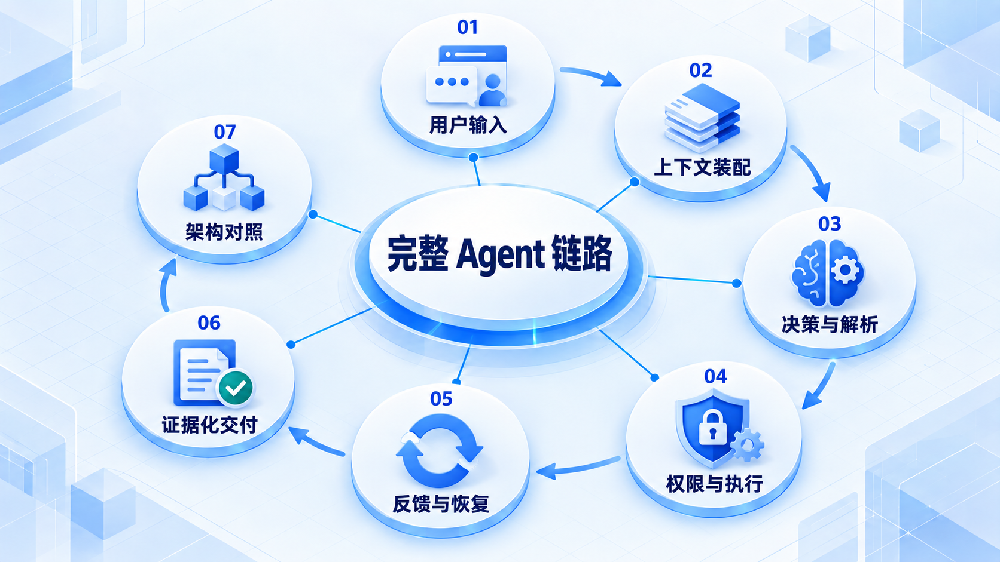
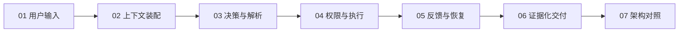

# 完整 Agent 链路

沿着输入、上下文、决策、执行与结果检查完整系统，再比较不同路线的控制权和适用边界。

## 学习路线

箭头表示本章概念的推荐学习顺序，不表示实际系统只允许单向运行。框架与方案对照中的选项可以按项目需要选择。

## 本章核心模块

1. **用户输入**
2. **上下文装配**
3. **决策与解析**
4. **权限与执行**
5. **反馈与恢复**
6. **证据化交付**
7. **架构对照**

## 按课程顺序阅读

1. [端到端 Agent 完整链路：从输入到证据化交付](<../../content/Agent开发/14-完整Agent链路与架构对照/01-端到端Agent完整链路.md>) · 文章
2. [权威 Agent 路线横向对照：共同链路、控制权与适用边界](<../../content/Agent开发/14-完整Agent链路与架构对照/02-权威Agent路线横向对照.md>) · 文章
3. [完整 Agent 链路与框架推荐阅读](<../../content/Agent开发/14-完整Agent链路与架构对照/000-完整链路与框架推荐阅读.md>) · 文章

[返回全部章节](README.md)
