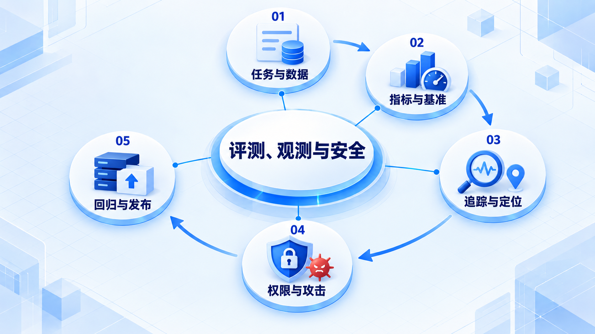

# 评测、观测与安全

先定义任务和成功标准，再选择数据、指标和运行证据；将权限与攻击测试纳入回归及发布判断。

## 学习路线

箭头表示本章概念的推荐学习顺序，不表示实际系统只允许单向运行。框架与方案对照中的选项可以按项目需要选择。

## 本章核心模块

1. **任务与数据**
2. **指标与基准**
3. **追踪与定位**
4. **权限与攻击**
5. **回归与发布**

## 按课程顺序阅读

1. [Agent Eval：数据集、指标与回归测试](<../../content/Agent开发/08-Evaluation Observability Safety/01-Eval数据集指标与回归测试.md>) · 文章
2. [可观测性：Trace、Metrics、Logs 与故障定位](<../../content/Agent开发/08-Evaluation Observability Safety/02-Trace指标与故障定位.md>) · 文章
3. [Prompt Injection、权限边界与 Human-in-the-loop](<../../content/Agent开发/08-Evaluation Observability Safety/03-Prompt Injection权限与Human in the loop.md>) · 文章
4. [Agent Benchmark Map：测量对象、环境、信号与限制](<../../content/Agent开发/08-Evaluation Observability Safety/04-Agent Benchmark Map.md>) · 文章
5. [Evaluation 闭环、Trace 与发布门](<../../content/Agent开发/08-Evaluation Observability Safety/05-Evaluation闭环与发布门.md>) · 文章
6. [评测、可观测性与安全推荐阅读](<../../content/Agent开发/08-Evaluation Observability Safety/000-评测与可观测性推荐阅读.md>) · 文章

[返回全部章节](README.md)
