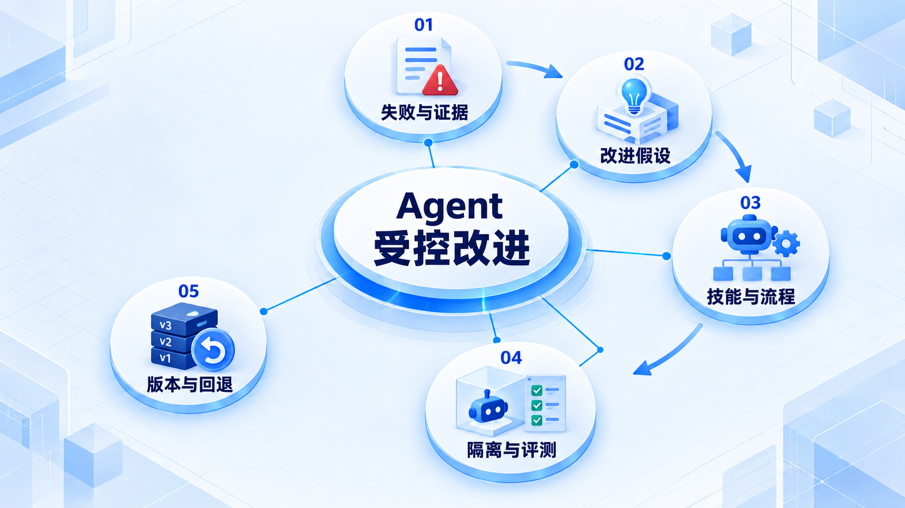
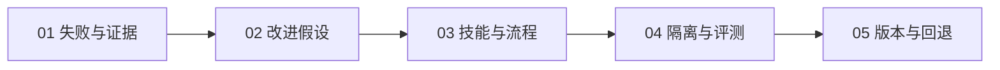

# Agent 受控改进

先收集失败证据，再提出可版本化的技能或流程改动；经过隔离评测后才推广，保留回退路径。

## 学习路线

箭头表示本章概念的推荐学习顺序，不表示实际系统只允许单向运行。框架与方案对照中的选项可以按项目需要选择。

## 本章核心模块

1. **失败与证据**
2. **改进假设**
3. **技能与流程**
4. **隔离与评测**
5. **版本与回退**

## 按课程顺序阅读

1. [Agent Evolution：受控改进闭环](<../../content/Agent开发/09-Agent Evolution/01-Agent Evolution总览与受控闭环.md>) · 文章
2. [Skill、Workflow 与 Program Evolution](<../../content/Agent开发/09-Agent Evolution/02-Skill Workflow与Program Evolution.md>) · 文章
3. [Evolution 的 Evaluation、Version、Sandbox 与 Rollback](<../../content/Agent开发/09-Agent Evolution/03-Evolution评测版本沙箱与回滚.md>) · 文章

[返回全部章节](README.md)
