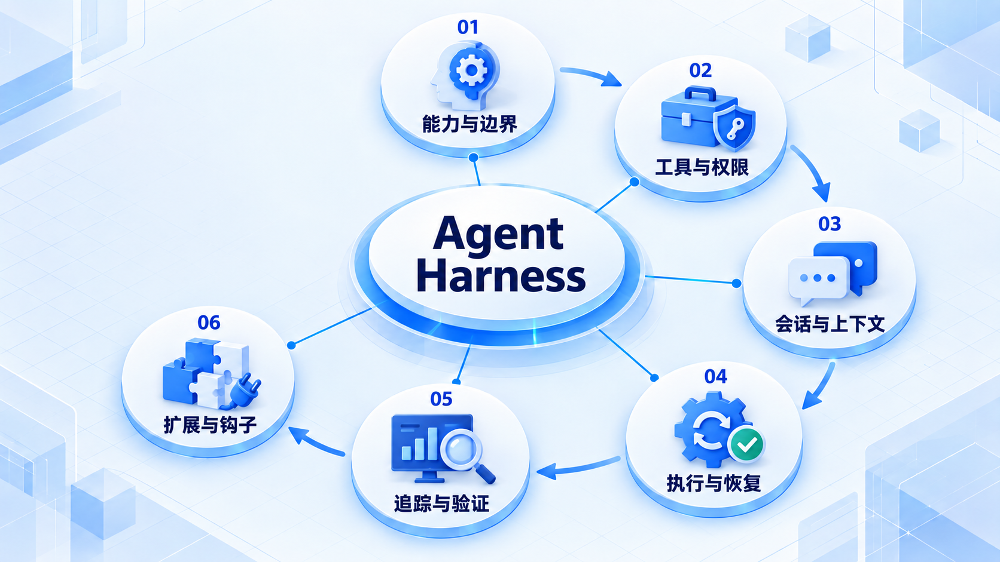

# Agent Harness

先区分模型决策和模型外的运行支撑，再把工具、权限、会话、执行和恢复接起来；扩展点应有清晰边界。

## 学习路线

箭头表示本章概念的推荐学习顺序，不表示实际系统只允许单向运行。框架与方案对照中的选项可以按项目需要选择。

## 本章核心模块

1. **能力与边界**
2. **工具与权限**
3. **会话与上下文**
4. **执行与恢复**
5. **追踪与验证**
6. **扩展与钩子**

## 按课程顺序阅读

1. [Agent Harness 架构：模型之外的能力来源](<../../content/Agent开发/06-Agent Harness/01-Agent Harness架构.md>) · 文章
2. [Tool Registry、Permission Gate、Session Store 与 Compaction](<../../content/Agent开发/06-Agent Harness/02-Registry Permission Session与Compaction.md>) · 文章
3. [Trace、调试、失败恢复与 Validation](<../../content/Agent开发/06-Agent Harness/03-Trace调试恢复与验证.md>) · 文章
4. [Executor 执行器：从已解析决策到可恢复的真实动作](<../../content/Agent开发/06-Agent Harness/05-Executor执行器与事件运行时.md>) · 文章
5. [Middleware、Hooks 与 Callbacks：横切能力的可控扩展点](<../../content/Agent开发/06-Agent Harness/06-Middleware Hooks与Callbacks.md>) · 文章
6. [Agent Harness 推荐阅读](<../../content/Agent开发/06-Agent Harness/000-Agent Harness推荐阅读.md>) · 文章

[返回全部章节](README.md)
