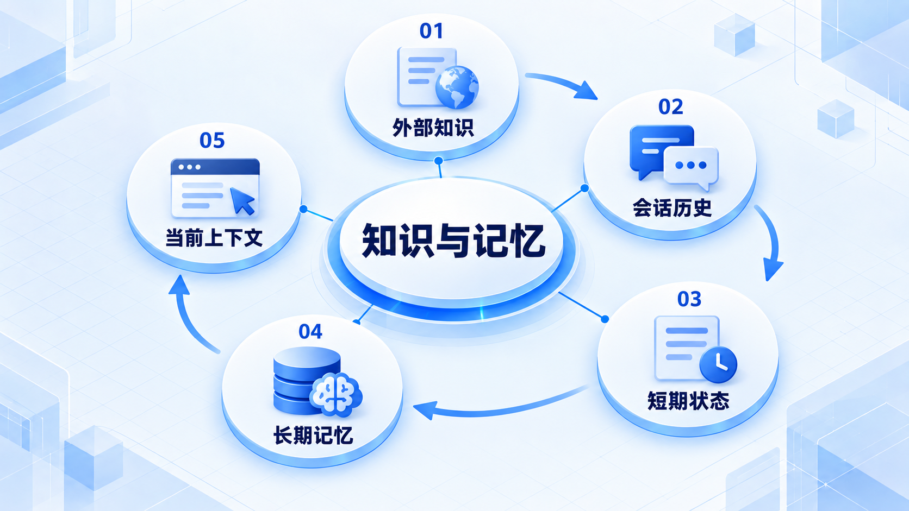
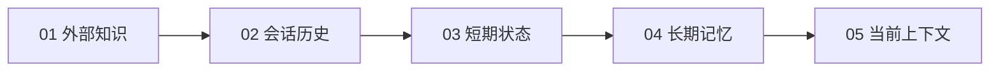

# 知识与记忆

先区分外部知识、跨轮记忆、历史记录和当前上下文，再决定哪些信息应该检索、保存或装配到本轮请求。

## 学习路线

箭头表示本章概念的推荐学习顺序，不表示实际系统只允许单向运行。框架与方案对照中的选项可以按项目需要选择。

## 本章核心模块

1. **外部知识**
2. **会话历史**
3. **短期状态**
4. **长期记忆**
5. **当前上下文**

## 按课程顺序阅读

1. [Knowledge、Memory、Context 与 History 的边界](<../../content/Agent开发/05-Knowledge与Memory/00-Knowledge与Memory边界.md>) · 文章
2. [RAG 知识检索](<agent-rag.md>) · 章节
3. [Memory 记忆管理](<agent-memory.md>) · 章节

[返回全部章节](README.md)
