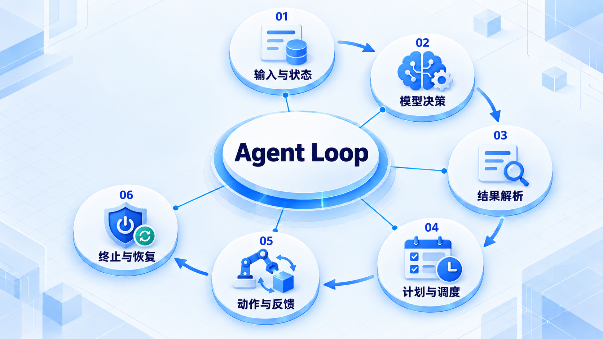
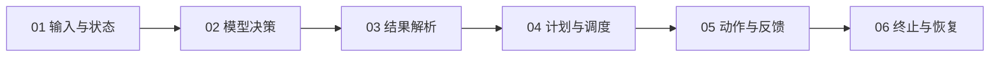

# Agent Loop

从最小循环出发，明确输入、状态、决策和动作；再加入计划、调度、终止与错误处理，避免无界运行。

## 学习路线

箭头表示本章概念的推荐学习顺序，不表示实际系统只允许单向运行。框架与方案对照中的选项可以按项目需要选择。

## 本章核心模块

1. **输入与状态**
2. **模型决策**
3. **结果解析**
4. **计划与调度**
5. **动作与反馈**
6. **终止与恢复**

## 按课程顺序阅读

1. [最小 Agent Loop 实现](<../../content/Agent开发/02-Agent Loop/01-最小Agent Loop实现.md>) · 文章
2. [结构化输出与 Agent 状态机](<../../content/Agent开发/02-Agent Loop/02-结构化输出与状态机.md>) · 文章
3. [Agent Loop 的终止条件、超时与错误处理](<../../content/Agent开发/02-Agent Loop/03-终止超时与错误处理.md>) · 文章
4. [任务拆分与 Plan 表示：从目标到可验证执行图](<../../content/Agent开发/02-Agent Loop/04-任务拆分与Plan表示.md>) · 文章
5. [Task Scheduler：依赖、并发、资源与动态重规划](<../../content/Agent开发/02-Agent Loop/05-Task Scheduler依赖并发与重规划.md>) · 文章
6. [Workflow 流程控制模式：从确定性链路到自主 Agent Loop](<../../content/Agent开发/02-Agent Loop/06-Workflow流程控制模式.md>) · 文章
7. [Output Parser 与结构化响应：从 Provider 事件到可执行决策](<../../content/Agent开发/02-Agent Loop/07-Output Parser与结构化响应.md>) · 文章
8. [Agent Loop 分层与机制选择](<../../content/Agent开发/02-Agent Loop/08-Loop分层与机制选择.md>) · 文章
9. [Agent Loop 推荐阅读](<../../content/Agent开发/02-Agent Loop/000-Agent Loop推荐阅读.md>) · 文章

[返回全部章节](README.md)
