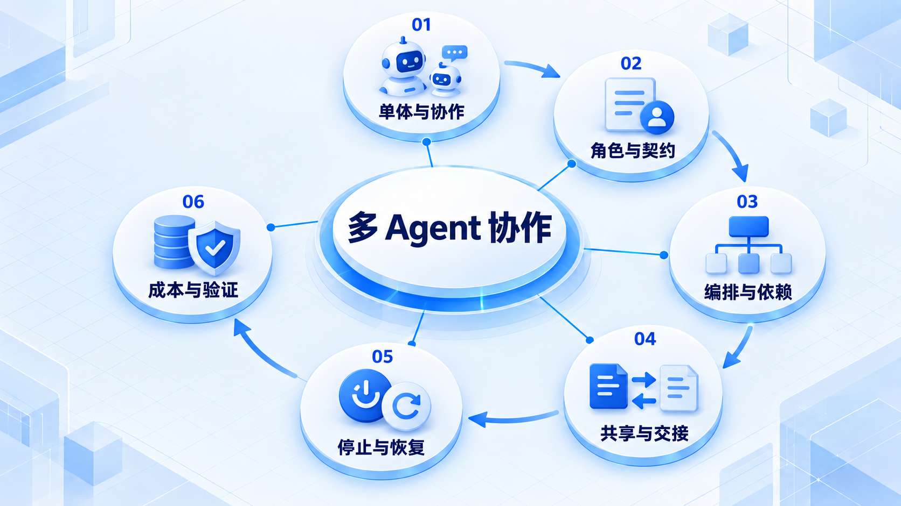

# 多 Agent 协作

先判断是否真的需要多个 Agent，再明确角色和交接契约；编排、停止条件与失败恢复必须一起设计。

## 学习路线

箭头表示本章概念的推荐学习顺序，不表示实际系统只允许单向运行。框架与方案对照中的选项可以按项目需要选择。

## 本章核心模块

1. **单体与协作**
2. **角色与契约**
3. **编排与依赖**
4. **共享与交接**
5. **停止与恢复**
6. **成本与验证**

## 按课程顺序阅读

1. [多 Agent：角色、职责与输入输出边界](<../../content/Agent开发/10-Multi-Agent/01-角色职责与输入输出边界.md>) · 文章
2. [Supervisor、Graph 与停止条件](<../../content/Agent开发/10-Multi-Agent/02-Supervisor Graph与停止条件.md>) · 文章
3. [多 Agent 故障模式与单 Agent 判断](<../../content/Agent开发/10-Multi-Agent/03-故障模式与单Agent判断.md>) · 文章
4. [多 Agent 推荐阅读](<../../content/Agent开发/10-Multi-Agent/000-多Agent推荐阅读.md>) · 文章

[返回全部章节](README.md)
