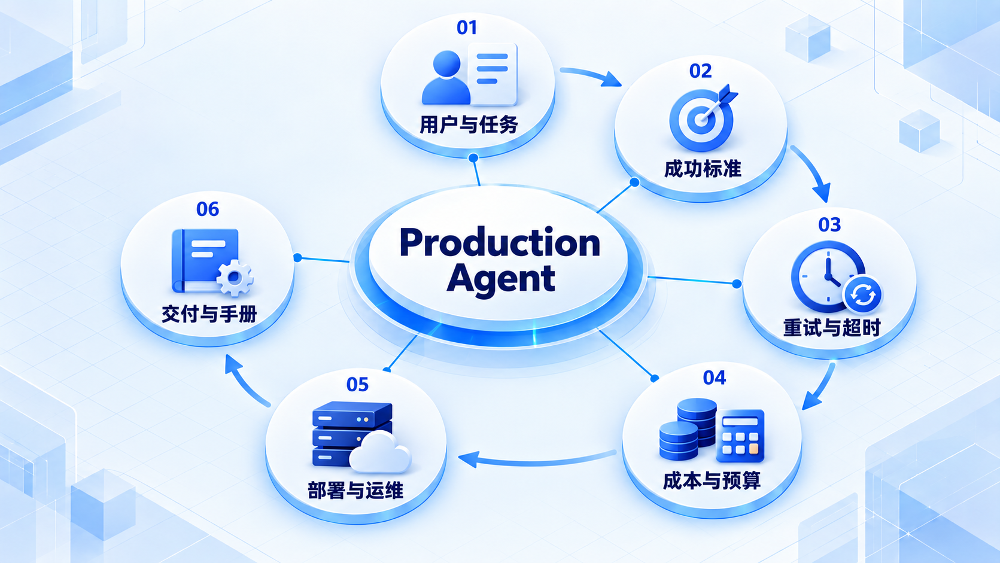

# Production Agent

先定义用户任务和完成标准，再控制失败、时间与成本；运行手册和交付检查同样属于生产能力。

## 学习路线

箭头表示本章概念的推荐学习顺序，不表示实际系统只允许单向运行。框架与方案对照中的选项可以按项目需要选择。

## 本章核心模块

1. **用户与任务**
2. **成功标准**
3. **重试与超时**
4. **成本与预算**
5. **部署与运维**
6. **交付与手册**

## 按课程顺序阅读

1. [生产级 Agent：用户、任务与成功标准](<../../content/Agent开发/12-Production Agent/01-用户任务与成功标准.md>) · 文章
2. [重试、超时、成本预算、部署与运维](<../../content/Agent开发/12-Production Agent/02-重试超时预算部署与运维.md>) · 文章
3. [README、运行手册与交付检查表](<../../content/Agent开发/12-Production Agent/03-README运行手册与交付检查表.md>) · 文章
4. [生产交付推荐阅读](<../../content/Agent开发/12-Production Agent/000-生产交付推荐阅读.md>) · 文章

[返回全部章节](README.md)
