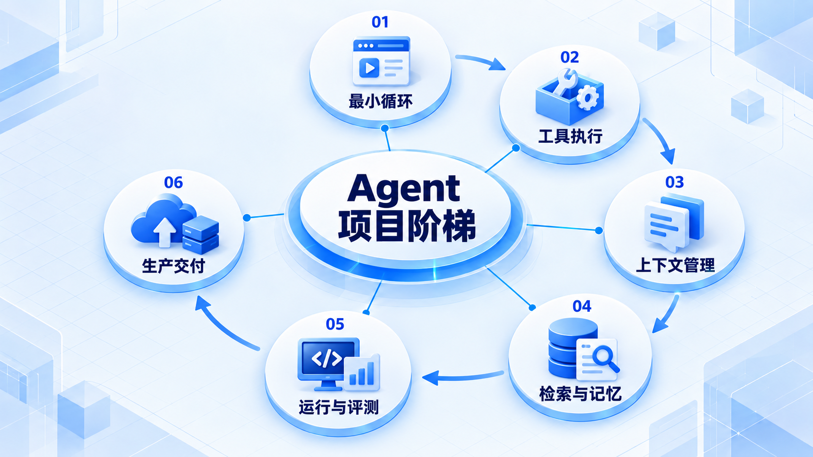
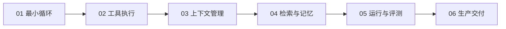

# Agent 项目阶梯

按 P0–P7 逐步练习，让每一步都有可以运行和验证的成果；先做可靠的小系统，再增加工具、检索和生产约束。

## 学习路线

箭头表示本章概念的推荐学习顺序，不表示实际系统只允许单向运行。框架与方案对照中的选项可以按项目需要选择。

## 本章核心模块

1. **最小循环**
2. **工具执行**
3. **上下文管理**
4. **检索与记忆**
5. **运行与评测**
6. **生产交付**

## 按课程顺序阅读

1. [P0–P7 Agent 工程项目阶梯](<../../content/Agent开发/13-Project Ladder/01-P0到P7 Agent工程项目阶梯.md>) · 文章
2. [项目阶梯推荐阅读](<../../content/Agent开发/13-Project Ladder/000-项目阶梯推荐阅读.md>) · 文章

[返回全部章节](README.md)
